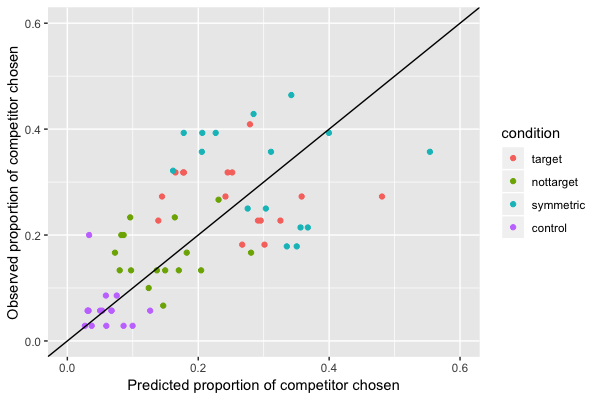
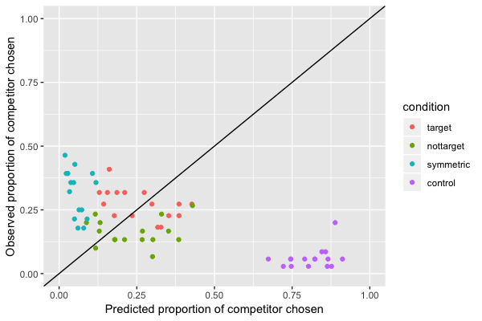

```{r setup, include=FALSE}
knitr::opts_chunk$set(echo = TRUE)
```

# Nameability and its effect on interpretation 

Here, I explore the RSA model of a pragmatic listener in Experiment 3 and examine how interpretation is affected in this model by changing the prior nameability of images in the experiment. First, we define a space of possible utterances: {'looks like a [target]', 'is a [target]', 'isn't a [target]', 'looks like a [competitor]', 'is a [competitor]', 'isn't a [competitor]'}. We also define a space of possible intended referents, namely the `target` and `competitor`. From this we can also define the literal semantic meanings of the six possible utterances. 

```{js}
var utterances = ["istarget", "looksliketarget","nottarget","iscompetitor","notcompetitor","lookslikecompetitor"];

var literalMeanings = {
  looksliketarget: function(state) { return state == "target" || state == "competitor"; },
  istarget: function(state) { return state == "target"; },
  nottarget: function(state) {return state == "competitor";  },
  lookslikecompetitor: function(state) { return state == "target" || state == "competitor"; },
  iscompetitor: function(state) { return state == "competitor"; },
  notcompetitor: function(state) {return state == "target";  },
};
```

We represent cost of the utterances as changing according to the trial in the experiment (recall that for any trial, the images will change, as will the speaker's exact utterance, e.g. from "It looks like a zebra" to "It looks like a railroad"). For now, the cost of any utterance containing a noun that denotes the target image on a given trial (i.e. 'looks like a [target]', 'is a [target]', 'isn't a [target]') is simply the inverse of the empirically-elicited nameability of the target (each nameability value is a value between 0 and 1 and denotes the proportion of participants in the Nameability norming study who could name the image). The same is true modulo competitor. 

```{js}
var cost = function (item) {
  return {
  "istarget": 1 / (item.target_nameability),
  "nottarget" : 1 / (item.target_nameability),
  "looksliketarget": 1 / (item.target_nameability),
  "iscompetitor" : 1 / (item.competitor_nameability),
  "notcompetitor" : 1 / (item.competitor_nameability)),
  "lookslikecompetitor" : 1 / (item.competitor_nameability)
};
} 
```

Lastly, prior probability of `competitor` as the intended referent is determined from the No-prompt norming study, using the proportion of participants who selected the competitor image on the corresponding trial from the No-prompt norming study.

```{js}
var statePrior = function(item) {
  return flip(item.competitor_prior) ? "competitor" : "target"
```

Now, suppose a given item of the main experiment is associated with the following data from the Nameability and No-prompt norming studies:

```{js}
{"id":"item_1","competitor_prior":0.5,"target_nameability":1,"competitor_nameability":1}
```

We also assume an alpha parameter value of 1. 

Above, we see that prior probability that the speaker intends the `competitor` image on this trial is 0.5, and we assume that the target and competitor images are equally nameable. In this scenario, upon observation of the utterance 'looksliketarget', posterior probability of the `competitor` image as intended referent is also 0.5. 

However, now let's imagine that in the Nameability norming study, only half of participants could name the competitor: 

```{js}
{"id":"item_1","competitor_prior":0.5,"target_nameability":1,"competitor_nameability":0.5}
```

Given the definition of the `cost` function above, a decrease in the nameability of the competitor image will cause an increase in the cost of the utterances 'looks like a [competitor]', 'is a [competitor]', and 'isn't a [competitor]'. Now, there is a likelihood of roughly 0.58 that the speaker, in uttering 'looks like a [target]', intended the competitor image.

# Visualizing/analyzing the nameability data

## Plotting competitor selections against competitor nameability 

Plotting target selections against target nameability is somewhat uninsightful, only because the nameability scores of all target images in the experiment are at or close to 1. However, there is more variance in the nameability scores of competitor images, and there does indeed appear to be a weak negative correlation between nameability and selections of the competitor image, as we expect on the analysis sketched above. 


## Putting nameability into the binomial regression model

```{}
glm (selection ~ condition * competitor_nameability, family = "binomial")
```

The binomial regression analysis with fixed effects of condition (reference level = "control" condition), competitor_nameability, and their interaction yields a marginally significant main negative effect of nameability ($\beta = -1.323$, $SE = 0.75$, p < 0.08) and no significant interaction effects. [Note: more complex models with random effects structures failed to converge - I started with the random effects structure below (the same structure as was used in the analysis of Experiment 3 reported in the QP) and pared down, but the only model to converge is the model reported above].

```{}
glmer(selection ~ condition * competitor_nameability + (1|workerid) + (1 + condition|id), family = "binomial")
```

# A new BDA model 

I've concluded that the old BDA model was doing a poor job at making predictions for two reasons, one conceptual (the way costs were defined) and one technical (the structure of the inference algorithm in WebPPL). First, take a look at the posterior predictive checks from the new model in the graph below (with y = x reference line). 



This new model contains: 

* A new way of structuring the inference algorithm: namely, a call to `mapData` rather than `map` when performing the inference, and a logic that more closely mirrors the BDA scripts for the si-paradigms project.

* 6 separate cost parameters for each of the following:
  + 'looks like a [target]'
  + 'is a [target]'
  + 'isn't a [target]'
  + 'looks like a [competitor]'
  + 'is a [competitor]'
  + 'isn't a [competitor]'

To convince you we need both changes, here's the predictive plot with the model where we have 6 separate cost parameters but the old inference structure:



And here's the predictive plot with the model with the new inference structure but 3 cost parameters (as in the analysis currently in the paper) rather than 6:  


