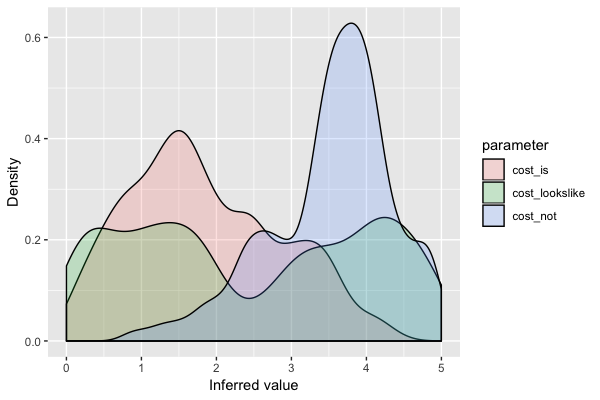
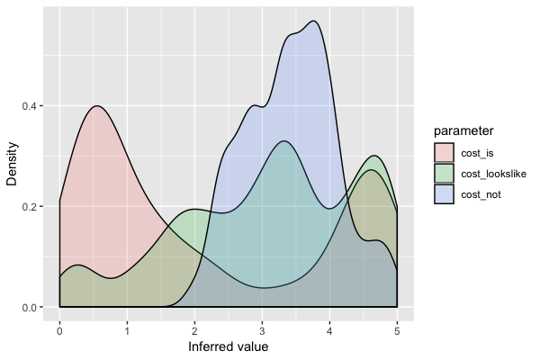
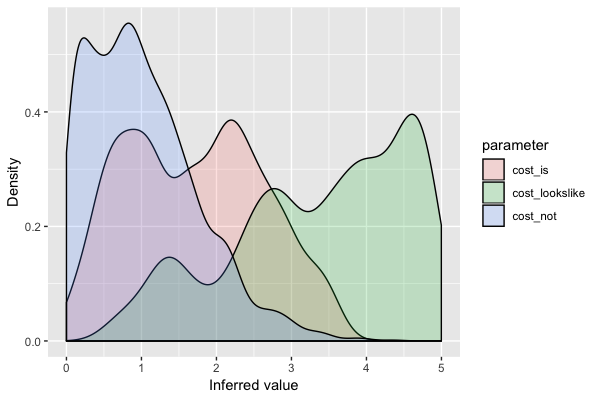
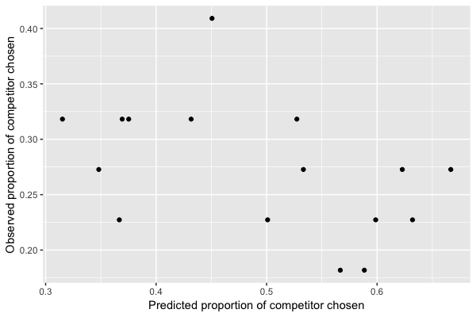
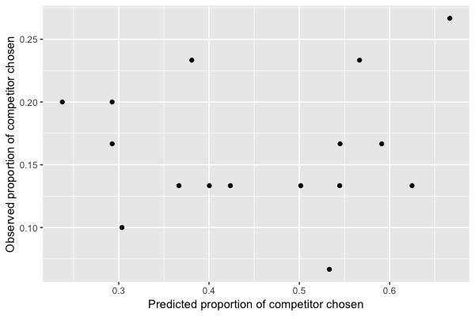
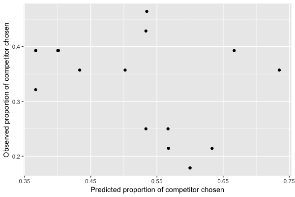

```{r global_options, include=FALSE}
knitr::opts_chunk$set(fig.pos = 'h')
```

```{r setup, include=FALSE}
knitr::opts_chunk$set(echo = TRUE)
```

#  Introduction

Successful linguistic communication depends on a listener considering not only what a speaker has said (e.g.  “John ate some of the cookies”)  but also the utterance alternatives a speaker could have produced but chose not to (*John ate all of the cookies*). This process yields inferences beyond the literal meaning of the original utterance (*John ate some, but not all, of the cookies*). Scalar implicature - the type of inference exemplified by the *not all* inference in the preceding discussion - is inextricably linked to the notion of an utterance alternative, as the following theory-neutral definition of scalar implicature demonstrates: 

\begin{exe}
\exi{}\label{potts} An utterance $U$ conveys a scalar conversational implicature iff there are alternative utterances $U'$ that are at least as relevant as $U$ in the discourse and that are communicatively stronger\footnote{Note that this definition leaves under-specified the exact type of communicative `strength' that we care about in the case of scalar implicature. As discussed below, many theorists have operationalized strength as logical entailment, but there are competing proposals (cf. \citealt{hirschberg1985theory}).} than $U$. (The content of this implicature will depend on the context, the nature of the utterance competition, and other pragmatic factors.) (\citealt{Potts:2013:PI}: 179)
\end{exe}

Though the idea that scalar implicature depends on utterance alternatives is uncontroversial, the precise nature of the relationship between alternatives and the inferential mechanisms giving rise to implicature remains hotly contested in the pragmatics literature. By and large, most mainstream theories of implicature are **categorical** theories in two important respects: first, these theories assume that alternative-hood is a binary, categorical feature of any utterance *U’* with respect to another utterance *U* - *all*, for example, is an alternative to *some*; *none* is not. Second, these theories conceptualize scalar inference as the categorical negation of meanings encoded by utterance alternatives, which proceeds either via counterfactual social cognitive inference (c.f. \citealt{grice1975logic}) or a semantic operator (c.f. \citealt{chierchia2006}).

A more recent framework of pragmatic analysis - the Rational Speech Act framework - abandons both of these categorical commitments in favor of gradient **probabilistic** views, both regarding the nature of alternative-hood and regarding the nature of scalar inference. First, rather than simply associating an utterance *U* with a set of alternatives, listeners are modeled in RSA as reasoning about speakers for whom linguistic behavior - i.e. their selection of an utterance to produce from the set of utterance alternatives - is underlyingly stochastic. In encountering an utterance *U*, listeners consider that the speaker may have produced alternative *U’* or *U’’*, but the a priori probabilities of the speaker producing either of these alternatives need not be equal (contra the categorical view). The inference mechanism is also probabilistic on this account: scalar inferences are conceptualized as a gradient, negative change in the a posteriori probability of meanings encoded by utterance alternatives. 

There are possible hybrids of the above views: for example, one might claim that while the alternative-hood is a binary feature, scalar inference is best represented probabilistically; conversely, one might claim that scalar inference proceeds via categorical inference mechanisms but, at the same time, argue for a rich, probabilistic representation of utterance alternatives a la RSA. In this paper, I explore this space of possible analyses and show that theories which represent alternatives probabilistically allow for the set of utterance alternatives to be large and logically-inconsistent with one another, contra theories which represent alternatives categorically (and regardless of how the inference mechanism is conceived). This is because the latter type of theory commits itself to a small, logically-consistent set of alternatives in order to solve what has become known in the pragmatics literature as the **symmetry problem**. 

This theoretical split is interesting insofar as recent empirical evidence puts pressure on the idea that the set of alternatives is, in fact, small and logically-consistent. In particular, a growing body of psycholinguistic research on scalar implicature priming suggests that the availability and strength of scalar inferences can be modulated by raising the salience of linguistic forms not commonly assumed (on the categorical view) to be in the set of alternatives. After I review this literature and its implications for a theory of alternatives, I motivate and report the results of three experiments designed to further expand this empirical picture. I’ll argue in particular from the results of my Experiment 3 that a probabilistic theory of alternatives best captures the full pattern of observations, and that the descriptive power of this theory is complemented by a probabilistic theory of the inference mechanism underlying scalar implicature. 

Along the way of this paper, I’ll also make the claim that a fully probabilistic theory best allows for the specification of explicit linking hypotheses which represent implicature priming as the behavioral reflex of listeners' expectations of speakers incrementally adapting in an unfolding discourse, where this adaptation is expressed as an attenuation in the strength and availability of scalar inferences. The paper thus contributes to a growing body of literature on the nature of listener adaptation and its role in pragmatic interpretation.\footnote{Links to all experiments, data, and analyses reported in this paper may be found at \url{https://github.com/bwaldon/alts}.}

#  Alternatives and the symmetry problem 

As mentioned above, most mainstream theories of implicature are categorical both in their understanding of alternative-hood and of the inference mechanism underlying scalar implicature. For ease of reference in what follows, I call this class of implicature theory \underline{Type 1}:

\begin{exe}
\exi{}Theory \underline{Type 1}: The inference mechanism underpinning implicature is the categorical negation of utterance alternatives; alternative-hood is a binary, categorical feature of alternatives.
\end{exe}

For example, according to theories which follow the framework of \cite{grice1975logic} in representing conversational implicature as the confluence of linguistic competence and social cognition, a scalar implicature is conveyed when a hearer engages in counterfactual reasoning about possible stronger alternative utterances a speaker could have produced but did not. The set of alternative utterances is, itself, unstructured - insofar as it contains all and only the utterances which possess the feature of being an alternative to the produced utterance (and contains no other information to distinguish between alternatives\footnote{(Though, e.g., form-based or context-specific considerations such as manner or discourse relevance may prune or expand the set of alternatives active in pragmatic interpretation.)}). The following Gricean-inspired analysis of scalar implicature is adapted from \cite{Potts:2013:PI}: 

\begin{exe}
\exi{} \begin{itemize}
    \item Let q = the proposition denoted by \textit{John ate some of the cookies}
    \item Assume a speaker Ellen asserts \textit{John ate some of the cookies} to a listener Kyle 
\end{itemize}
 
\begin{enumerate}[i.]

  \item \textit{Contextual premise:} Ellen and Kyle know that John is able to eat any portion of some contextually-salient batch of cookies.
\item \textit{Contextual premise:} Ellen is maximally-informed with respect to how many cookies John ate.
\item Assume that Ellen is cooperative and obeys the Gricean maxims of quality and quantity.\footnote{Grice's maxim of quantity: ``Make your contribution as informative as is required. Do not say more than is
required." The maxim of quality: ``Contribute only what you know to be true. Do not say false things. Do not say
things for which you lack evidence."}
\item Then she will assert what is maximally relevant, informative
and true.

\item 

An alternative proposition p (\textit{John ate all of the cookies}) is more informative and (at least) as relevant in this context than is q.

\item Therefore, Ellen must be experiencing a clash between the maxims: she cannot assert p because she lacks sufficient evidence for p.
\item By (ii), she must lack evidence because it is false.
  
\end{enumerate}

\textbf{Implicature: }it is not the case that John ate all of the cookies. 
\end{exe}

The aforementioned analysis of scalar implicature shares commonalities with more recent grammaticist analyses, whereby scalar implicature is associated with an inference triggered by a semantic operator whose input is a proposition $p$ and whose output is a proposition computed from $p$ and a set of alternatives to $p$. The following analysis of scalar implicature is adapted from one proponent of the grammaticist view, \cite{chierchia2006}. The analysis must first define a function $||\cdot||^{ALT}$ which can map propositions to sets of propositions\footnote{One account offered by \cite{chierchia2006}, $||\cdot||^{ALT}$ is the function  that ``associates any item [not necessarily a proposition] with its scalar alternatives" (\citealt{chierchia2006}: 546). The ability to specify alternatives for sub-sentential items - and thus to recursively define propositional alternatives - is necessary to capture embedded scalar inferences within Chierchia's framework. But crucially, Chierchia leaves under-specified how exactly the alternatives of any item are computed.}; for example, 

\begin{exe}
\ex\label{alts} $||$John ate some of the cookies$||^{ALT}$ = 
\{\textit{John ate some of the cookies}, \textit{John ate all of the cookies}\}
\end{exe}

The aforementioned semantic operator takes as its input a proposition and returns a proposition which is a conjunction of the input proposition and the statement that the input proposition is the strongest true alternative to itself: 
\begin{exe}
\ex\label{exh}  O$_C$(p) = $p \land \forall q \in C [q \rightarrow p \subseteq_c q]$, where $C =$ the output of $||$p$||^{ALT}$
\end{exe}

Given how we specify the semantic operator O$_C$ in (\ref{exh}) and how we specify the alternatives to \textit{John ate some of the cookies} in (\ref{alts}), the analysis predicts that \textit{John ate some of the cookies} under the scope of O$_C$ should give rise to the inference that it is not the case that John ate all of the cookies: 

\begin{exe}
\ex O$_C$(\textit{John ate some of the cookies}) \\ = \Big[
\textit{John ate some of the cookies} $\land$ \\
$\forall p: p \in ||$John ate some of the cookies$||^{ALT}$ $\land$ p $\rightarrow$ \\
\textit{John ate some of the cookies} $\subseteq$ p \Big]

Pragmatically-enriched meaning: \textit{John ate some of the cookies} $\land$ $\neg$(\textit{John ate all of the cookies})

\end{exe}

One commonality between Gricean and grammaticist approaches is that neither, on its own, is a fully-specified theory of how to compute the alternatives of a given utterance, but both assume that alternative-hood is a binary, categorical feature: either *U'* is an alternative to *U*, or it isn't. Both theories claim that a scalar implicature will be conveyed by an utterance in case there are pragmatically-active stronger alternatives to that utterance, but this alone is not sufficient to avoid what \cite{Fox2011}, following von Fintel (2002), call the \textit{symmetry problem}. The symmetry problem is illustrated as follows (discussion adapted from \citealt{Fox2011}): 

\begin{exe}
\ex \begin{itemize}
    \item Let $q$= the proposition denoted by \textit{John ate some of the cookies}. Let $p_1$ = the proposition denoted by \textit{John ate all of the cookies}, which is stronger with respect to logical entailment than q.
    \item Let $p_2$ = the proposition denoted by \textit{John ate \underline{some but not all} of the cookies}, which is also stronger with respect to logical entailment than q.
    \item $q \rightarrow p_1 \lor p_2$.
    \item $p_1$ and $p_2$ contradict one another. 
    \item $q$ seems to implicate $\neg p_1$, but this is only possible if $p_2$ is not activated as an alternative to $q$. 
\end{itemize}

\end{exe}

By virtue of the fact that $p_1$ and $p_2$ contradict one another, we call $p_1$ and $p_2$ \textit{symmetric alternatives} of $q$. The symmetry problem is twofold. First, we want a way to favor $p_1$ as an alternative to q over $p_2$: $q \land \neg p_1$ corresponds to the desired `some but not all' strengthening of $q$ in the context of utterance provided in, e.g., (2), while $q \land \neg p_2$ expresses a proposition that is truth-conditionally equivalent to \textit{John ate all of the cookies} (clearly not the desired strengthening of $q$ in the context of 2)\footnote{Note furthermore that there is nothing inherent to scalar implicature as we have defined it in (\ref{potts}) that seems to favor $p_1$ as an alternative over $p_2$; for example, $p_1$ being more relevant than $p_2$ in the context of utterance. von Fintel (2002) [\url{http://web.mit.edu/24.954/www/files/24.954.lecturenotes.pdf}] remarks that in a context where \textit{How many of the boys are at the party?} is under discussion, \textit{all of the boys are at the party} seems to be just as relevant as \textit{some but not all of the boys are at the party.} }. Second, asserting $q$ cannot implicate both $\neg p_1 \land \neg p_2$ because this conjunction is a contradiction. Avoiding these two issues - illicit inferences and contradictory meanings - is a main desideratum of any theory of scalar inference. That is, a successful theory \textbf{breaks} symmetry in a manner which delivers the right predictions regarding the nature of the scalar implicature(s) conveyed by a given utterance. 

Categorical theories of scalar inference such as those discussed above - whereby pragmatically-enriched meanings are derived via the categorical negation of communicatively stronger utterance alternatives - thus require an auxilliary theory of utterance alternatives in order to break symmetry. If we furthermore conceive of alternative-hood as a binary feature of the relationship between two utterances (as is the case with \underline{Type 1} theories), then the theory of alternatives must have something to say about why, e.g., $p_1$ is in the set of alternatives but $p_2$ - and perhaps other, equally-relevant utterance alternatives - are not. In other words, one way to break symmetry (given a categorical theory of scalar inference) is to posit that the set of alternatives contains a relatively small number of utterances which are logically consistent with one another, such that negating each alternative does not yield a contradiction, as above. Below, I review attempts in the pragmatics literature to break symmetry in exactly this way. 

\setlength{\leftskip}{0pt}

## Breaking symmetry via constraints on alternatives

\cite{Horn1972} proposes an account of scalar implicature whereby the calculation of alternatives is driven by conventionalized scalar relationships between lexical items. According to Horn, these scales are always ordered according to the relative logical strength of the lexical items on the scale. Utterance alternatives are then computed by taking the original utterance and replacing an lexical item from that utterance with one of that lexical item's stronger scalemates. This provides a straightforward way of understanding why \textit{John ate all of the cookies} may be an alternative to \textit{John ate some of the cookies}: an item in the original utterance, \textit{some}, is replaced with another item, \textit{all}, which stands in an asymmetric logical entailment relationship to \textit{some}. That is, Horn proposes that $<$some, all$>$ is a conventionalized lexical scale from which alternatives may be computed. 

Horn proposes several other lexical scales which are similar to the $<$some, all$>$ scale in that they represent an ordering of logical entailment. These scales include the scale of cardinal numerals, $<$or, and$>$, $<$might, must$>$, $<$pretty, beautiful$>$, and $<$warm, hot$>$. Importantly, $<$some, some but not all$>$ is not taken by Horn to be a scale, even though the two items stand in an asymmetric logical entailment relationship to one another. The same can be said of potentially problematic scalar orderings such as $<$or, either-or$>$ or $<$N, exactly N$>$ (for any cardinal number N), all of which would lead to a similar symmetry problem as outlined above. Symmetry is thus broken on the grounds that only select alternatives are activated in pragmatic inference - and the alternatives which we happen to activate lead to empirically satisfying results (\textit{some} implicates not \textit{all}, \textit{or} implicates not \textit{and} and does not implicate not \textit{either-or}, etc). 

Though this may at first seem to have the air of stipulation, Horn provides some support for the idea that while, for example, $<$some, all$>$ has conventionalized as a lexical scale, $<$some, some but not all$>$ has not. Evidence comes from focus or contrastive discourse environments of the form in (\ref{horndiscourse}), where a scalar inference of the form $\neg Y$ is canceled, suspended, or reinforced in the context of asserting $X$ (discourse frames adapted from \citealt{hornabbott} as cited in \citealt{Collins:2017}): 

\begin{exe}
  \ex\label{horndiscourse} \begin{enumerate}[i. ]

\item not only X but Y
\item  X and for all I know Y 
\item  X if not Y
\item  X or even Y
\item  X, indeed/in fact Y
\item  not even X, let alone Y 
\item Y, or at least X

\end{enumerate}
\end{exe}
  
For any two items $X$ and $Y$, their acceptability in environments such as those in (\ref{horndiscourse}) is evidence that those two items are, to borrow the language of \cite{hornabbott}, ``natural paradigmatic alternatives" (334). The acceptability of (\ref{sometest}) and (\ref{manytest}) supports this analysis for \textit{some} with respect to \textit{many} and \textit{all}, while (\ref{somenotalltest}) points against a similar analysis for \textit{some} and \textit{some but not all}:

\begin{exe}
  \ex\label{sometest} \begin{enumerate}[i. ]

\item not only some but all
\item  some and for all I know all 
\item  some if not all
\item  some or even all
\item  some, indeed/in fact all
\item  not even some, let alone all 
\item all, or at least some

\end{enumerate}
\end{exe}


\begin{exe}
  \ex\label{manytest} \begin{enumerate}[i. ]

\item not only some but many
\item  some and for all I know many 
\item  some if not many
\item  some or even many
\item  some, indeed/in fact many
\item  not even some, let alone many 
\item many, or at least some

\end{enumerate}
\end{exe}


\begin{exe}
  \ex\label{somenotalltest}  \begin{enumerate}[\# i. ]

\item not only some but some but not all
\item  some and for all I know some but not all 
\item  some if not some but not all
\item  some or even some but not all
\item  some, indeed/in fact some but not all 
\item  not even some, let alone some but not all 
\item some but not all, or at least some

\end{enumerate}
\end{exe}

One major revision to this account comes from \cite{gazdar1979pragmatics}, who argues that the scales from which alternatives are computed should rather be understood as conventionalized scales of \textit{semantic representations} rather than lexical scales. One of Gazdar's key observations is that by positing scales at the level of the lexicon rather than at a deeper level of representation, the analysis put forward by \cite{Horn1972} fails to account for the \textit{nondetachability} of scalar inferences: independent of the individual lexical choices one makes in forming an utterance, we expect regularity in the implicatures that semantically-equivalent utterances will give rise to. For example, in (\ref{hberg73}), both response (a) and response (b) may give rise to the implicature that for all A knows, \textit{from both courses} is not certain (example from \citealt{hirschberg1985theory}: 70, her example 73): 

\begin{exe}
\ex\label{hberg73} A: I think you would have to get it from the instructor for the course...

B: For which course?

a. A: Possibly from both courses.

b. A: Maybe from both courses.
\end{exe}

If scales are built from contrasts between lexical items, as \cite{Horn1972} takes them to be, then we miss the generalization that non upper-bounded expressions of possibility such as \textit{possibly} and \textit{maybe} are associated with inferences of non-maximal certainty. Rather, we are put in a position of having to stipulate that \textit{possibly} and \textit{maybe} each reside on a distinct lexical scale with \textit{certain}. Gazdar's solution remedies this problem, but opens a new one: at \textit{which level} of semantic representation are the scales derived? Gazdar is hesitant to claim that scales are derived at the level of semantic interpretation, on the grounds that conversational implicatures in general may vary, even between truth-conditionally equivalent sentences. For example, a sentence involving the verb phrase connective \textit{and} may give rise to different temporal conversational implicatures depending on the order of the conjuncts. Thus, for Gazdar, an intermediate notion of semantic representation - somewhere between semantic interpretation and lexical representation (where, for example, information such as order of verb phrase conjuncts is preserved) - is the level at which scales should be derived. 

However, \cite{hirschberg1985theory} observes that in a number of cases (including upper-bounding inferences with \textit{some}, \textit{or}, and cardinal numbers), truth-conditional semantic interpretation is an acceptable level at which to compute utterance alternatives. Moreover, temporal conversational implicatures involving \textit{and} are qualitatively different from scalar implicatures in that the latter, but not the former, presumably relies on a clash in the Gricean maxims of quantity and quality in order for the inference to come about: the temporal \textit{and}-implicature is presumably a manner implicature, and not a quantity one. While Hirschberg concedes that "a general representation of conversational implicature must accommodate conversational implicatures that rely upon the Maxim of Manner for their interpretation" (70), she remarks that "Gazdar's specific claim about scalar quantity implicature" - in particular the need to compute scalar and non-scalar alternatives at the same level of semantic representation - "is unclear" (ibid). 

Hirschberg's second observation with respect to the analysis put forth by \cite{gazdar1979pragmatics} is that he, like Horn, must continue to operate on the assumption that scales are somehow "simply given" (70). That is, there remains a lack of a fully descriptively-adequate analysis of where scales come from and of how to characterize their constraints. Though logical entailment appears to be an operable notion in scalar inference, Hirschberg observes that this not a sufficient - or even necessary - condition for deriving scales. Hirschberg offers a number of semantic orderings which support scalar inferences and notes that "[w]hile many might be defined by some notion of entailment, a number cannot" (84). 

For example, orderings such as $<$dating, married, engaged$>$, $<$sick, dying$>$, $<$condone, promote$>$ (e.g. violence), and  $<$misdemeanor, felony$>$ all appear to be pragmatically-active scales, which is supported by the fact that they licit in the discourse environments from (\ref{horndiscourse}).\footnote{Hirschberg, for her part, takes issue with Horn's diagnostics for scales which support scalar inference. As she notes, Horn's discourse environments ``will identify scales such as \textit{only vote/ did vote} from [(\ref{hirschdiag}-a)] and \textit{bald/exists} from [(\ref{hirschdiag}-b)]", which are clearly not pragmatically-active orderings:
\begin{exe}
\ex\label{hirschdiag}
a. Only Muriel voted for Humphrey if even she did.


b. The king of France is bald if there is a king of France.
\end{exe}

Of course, if we continue to assume that scales must be orderings of logical entailment, then the data in (\ref{hirschdiag}) do not pose a problem for Horn.
 } However, there are no logical entailment relations between any of the items in these orderings. Rather, Hirschberg argues that a more general and more context-sensitive notion of communicative strength is needed.

 \cite{Horn1989-HORANH}, cited in \cite{Matsumoto1995}, presents an analysis specifically designed to constrain scales such that orderings such as $<$some, some but not all$>$, $<$or, either-or$>$ and $<$N, exactly-N$>$ are ruled out for the purposes of pragmatic inference. The constraint proposed by Horn builds off an observation that linguistic expressions may have one of three monotonicity properties: they may be upward monotone, as in the case of the generalized quantifier \textit{some men}; downward monotone, as in the case of \textit{no men}; or nonmonotone, as in the case of \textit{exactly three men}. \cite{Horn1989-HORANH} introduces a constraint on alternatives whereby alternatives may not be calculated from scales where the expressions are nonuniform in their monotonicity behavior; moreover, nonmonotone expressions may never participate in scales.
 
 Matsumoto caches out \cite{Horn1989-HORANH}'s observation as a more generalized conversational condition on pragmatic competition, as articulated below (from \citealt{Matsumoto1995}: 25):
 
 \begin{exe}
 \ex Conversational Condition: The choice of W instead of S must
not be attributed to the observance of any information-selecting
Maxim of Conversation other than the Quality Maxims and the
Quantity-1 Maxim (i.e., the Maxims of Quantity-2, Relation,
and Obscurity Avoidance, etc.).\footnote{Matsumoto, following Grice, makes a distinction between two quantity maxims: a Quantity-1 maxim, whereby speakers are directed to ``make your contribution as informative
as is required", and a Quantity-2 maxim: ``do not
make your contribution more than is required in the context of the exchange". That is, the Quantity-1 and Quantity-2 maxim taken together simply amount to Grice's original quantity maxim.}
 \end{exe}

As illustration of this principle in action, Matsumoto provides examples such as the following (taken from \citealt{Matsumoto1995}: 45-46): 

\begin{exe}
\ex\label{mencame}\begin{xlist}
\ex ``Three men came."
\ex `(The speaker believes) it is not the case that exactly three men came.'
\ex `(The speaker believes) exactly three men came.'
\ex ``Exactly three men came."
\end{xlist}
\ex\label{billjohn}\begin{xlist}
\ex ``Bill met John on the way home."

(where the speaker knows that meeting Mary is of concern to the hearer)
\ex `(The speaker believes) is not the case that Bill met John but not Mary on the way home.'
\ex `(The speaker believes) Bill met only John on the way home.'
\ex ``Bill met John but not Mary (or any other person) on the way home."
\end{xlist}
 \end{exe}

Matusmoto remarks that while the (d) sentences asymmetrically entail the (a) sentences above and are thus stronger than those sentences, the (b) sentences are not available implicatures. Rather, it seems that only the (c) sentences are available inferences. Rather than stipulate a monotonicity constraint on scales in the vein of \cite{Horn1989-HORANH}, Matsumoto offers the following explanation: in asserting (\ref{mencame}-a), the only utterances which may act as alternatives are those which themselves would license quantity implicatures had they been asserted (e.g. \textit{four men came}, \textit{five men came}, etc.). (\ref{mencame}-d) is not such a candidate, as \textit{exactly N} does not license scalar implicatures. A similar pattern of reasoning holds for (\ref{billjohn}): \textit{Bill met Mary} may license a quantity implicature, unlike \textit{Bill met John but not Mary}, hence why the former, but not the latter, may be activated as an alternative to the original utterance. 
 
One commonality shared among \textit{some} with respect to \textit{some but not all}, \textit{or} with respect to \textit{either-or}, and \textit{N} with respect to \textit{exactly N} is that the latter is morphosyntactically more complex than the former. It may thus be tempting to rule out these pairings as pragmatically-active contrasts simply on the basis that alternatives may not be structurally more complex than the original utterance. However, \cite{Matsumoto1995} presents data which problematizes this view, as in the following example (taken from \citealt{Matsumoto1995}: 44):

\begin{exe}
\ex\label{warm}\begin{xlist}
\ex It was warm yesterday, and it is a little bit more than warm today.
\ex It was a little bit more than warm yesterday, and it is a little bit more
than warm today.
\end{xlist}
\end{exe}

In the below example, the (b) sentence is intuitively more complex than the (a) sentence; but nonetheless, (b) appears to be a salient alternative to (a), in that (a) appears to give rise to the inference that it is not the case that it was a little bit more than warm yesterday. Matsumoto takes this as evidence that alternatives cannot be ruled out due to relative structural complexity. 

\cite{Katzir2007} responds in turn that a theory of alternatives computed from scales - even when those scales are constrained following \cite{Matsumoto1995} or \cite{Horn1989-HORANH} - appears to yield inadequate empirical coverage. In support of this claim, Katzir first offers data such as the following as evidence that a scale-based account undergenerates (examples from \citealt{Katzir2007}: 677): 

\begin{exe}
\ex\label{5} \begin{xlist} 
\ex I doubt that exactly three semanticists will sit in the audience.
\ex I doubt that three semanticists will sit in the audience.
\end{xlist}
\ex\label{6} \begin{xlist} 
\ex If we meet John but not Mary it will be strange.
\ex If we meet John it will be strange.
\end{xlist}
\ex\label{7} \begin{xlist} 
\ex Everyone who loves John but not Mary is an idiot.
\ex Everyone who loves John is an idiot.
\end{xlist}
\end{exe}

According to \cite{Katzir2007}, in (\ref{5})-(\ref{7}), the assertion of the (a) sentence seems to give rise to the inference that the (b) sentence is unassertable (if not necessarily untrue). However, the scales such as $<$three, exactly three$>$ and $<$John, John but not Mary$>$ are ruled out on either \cite{Matsumoto1995}'s or \cite{Horn1989-HORANH}'s analyses. Moreover, Katzir offers data such as the following to suggest that a scale-based account sometimes overpredicts the prevalence of scalar inferences; for example, the (a) sentences below do not implicate the negation of the respective (b) sentence (examples from \citealt{Katzir2007}: 684): 

\begin{exe}
\ex\label{19} \begin{xlist} 
\ex A man came to every party.
\ex A tall man came to every party.
\end{xlist}
\ex \begin{xlist} 
\ex Each reporter talked to a candidate.
\ex Each reporter talked to a candidate who sang.
\end{xlist}
\ex\label{20} \begin{xlist} 
\ex John is sure that many dogs will be sold.
\ex John is sure that many dogs with long tails will be sold.
\end{xlist}
\end{exe}

In (\ref{19}) through (\ref{20}), we have examples of potential orderings - including $<$a man, a tall man$>$, $<$a candidate, a candidate who sang$>$, $<$many dogs, many dogs with long tails$>$ - which are neither blocked by the uniformity of monotonicity principle proposed by \cite{Horn1989-HORANH} nor by the Conversational Condition proposed by \cite{Matsumoto1995}. However, as Chris Potts (p.c.) points out, it does not necessarily follow that the analyses put forward by these authors predict illicit scalar inferences in these cases, provided that we assume listeners reason about only those alternatives that are at least as relevant in context as the original utterance (and it is easy to imagine a context where, for example, interlocutors are interested in communicating whether and how many men came to a party, with no regard for the tallness of those men). In fact, on Katzir's own account, alternatives to a given utterance should only be those that are \textit{weakly assertable} in context, where weak assertability is defined partly in terms of discourse relevance. So it is not clear whether (\ref{19}) through (\ref{20}) motivate a new analysis of alternatives. 

\cite{Katzir2007}, for his part, takes the data in (\ref{5}) through (\ref{20}) to be a challenge for existing scale-based accounts of alternative computation. Instead, he proposes the following principles from which alternatives are calculated: 
\begin{exe}
\ex \begin{itemize}
    \item SUBSTITUTION SOURCE:
Let $\phi$ be a parse tree. The substitution source for $\phi$, written as L($\phi$),
is the union of the lexicon of the language with the set of all subtrees of $\phi$.

\item STRUCTURAL COMPLEXITY:
Let $\phi$, $\psi$ be parse trees. If we can transform $\phi$ into $\psi$ by a finite series of
deletions, contractions, and replacements of constituents in $\phi$ with
constituents of the same category taken from L($\phi$), we will write
$\psi \lesssim \phi$ If $\psi \lesssim \phi$ and $\phi \lesssim \psi$ we will write $\psi \sim \phi$ If $\psi \lesssim \phi$ but not $\phi \lesssim \psi$
will write $\psi < \phi$.
\item STRUCTURAL ALTERNATIVES:
Let $\phi$ be a parse tree. The set of structural alternatives for $\phi$, written as
$A_{str}(\phi)$,, is defined as $A_{str}(\phi)$ := \{$\phi' : \phi ' \lesssim \phi$\}

\end{itemize}
\end{exe}

Katzir's analysis thus allows for the alternatives of an utterance to be those structures of equal or lesser structural complexity than the original utterance. Katzir's definition of a \textit{SUBSTITUTION SOURCE} provides that alternatives derived from substituting material in the original utterance with other material from that same utterance is a neutral operation with regards to structural complexity. This circumvents the original problem posed by \cite{Matsumoto1995} in example (\ref{warm}): because \textit{a little bit more than warm} is a subtree of (\ref{warm}-a), it is in the substitution source with respect to that sentence. This allows for the construction of (\ref{warm}-b) as an alternative, where \textit{a little bit more than warm} simply replaces \textit{warm} in the first conjunct of the sentence.\footnote{See \cite{Fox2011} for an attempt to extend this theory to one of alternative computation in focus constructions.}

# Mapping the space of scalar implicature theories

The above review shows that specifying an adequate theory of alternatives has been an active domain of pragmatics research for decades; however, this work has overwhelmingly been done in the \underline{Type 1} theoretical paradigm. That is, research on alternatives has been driven largely by one understanding of the nature of scalar inference, namely that these inferences come about via negation of stronger alternatives, and by one understanding of the nature of alternatives, namely that alternative-hood is a binary, categorical feature of the relationship between two utterances. Thus, in all of the accounts discussed above, it is assumed that symmetry must be broken by restricting the set of alternatives to which an utterance is contrasted in pragmatic interpretation. As soon as our assumptions regarding the nature of the alternatives are relaxed, the need for a small, logically consistent set of alternatives ordered on a scale is obviated, as I demonstrate below.

First, I claim that conceptualizing scalar inference as a (non-categorical) posterior update in the likelihood of meanings expressed by alternatives is, in itself, insufficient for symmetry breaking (given the presence of symmetric alternatives in the alternative set). Using the analytic machinery of the Rational Speech Act (RSA) framework, I explore and compare three classes of theories against \underline{Type 1} theories to demonstrate that this is the case:

\begin{exe}
\exi{}Theory \underline{Type 2}: The inference mechanism underpinning implicature is a soft posterior update on the likelihood of world states; alternative-hood is a binary, categorical feature of alternatives.
\exi{}Theory \underline{Type 3}: The inference mechanism underpinning implicature is a soft posterior update on the likelihood of world states; the representation of utterance alternatives is non-trivially probabilistic\footnote{"Non-trivially" in the sense that listeners are modeled as having non-uniform prior expectations about the speaker's choice of utterance.}.
\exi{}Theory \underline{Type 4}: The inference mechanism underpinning implicature is the categorical negation of utterance alternatives; the representation of utterance alternatives is non-trivially probabilistic. 
\end{exe}

While a \underline{Type 2} theory will fail to break symmetry given symmetric alternatives, a \underline{Type 3} theory will accomplish this given additional assumptions about listener's a priori expectations regarding the speaker's choice of utterance. I then show that, in fact, representing alternatives in this way obviates the need for a probabilistic representation of the scalar inference, if our desire is merely to break symmetry (that is, a \underline{Type 4} theory will also accomplish this). However, the additional probabilistic machinery of \underline{Type 3} allows for the specification of explicit and quantitative linking hypotheses from pragmatic competence to behavior in the implicature priming paradigms with which the experimental portion of the paper is concerned. The following section recapitulates the main features of the RSA framework before exploring these claims in more depth.

##  Probabilistic pragmatics and the Rational Speech Act framework 

As it is presented by \cite{goodman2013knowledge}, the Rational Speech Act model is an iterative, probabilistic model of pragmatic competence in which utterance interpretation is represented as a distribution over possible meanings given an observation of that utterance. Just as with more traditional Gricean accounts, scalar implicature in the RSA framework is, at its core, the product of counterfactual reasoning about alternative utterances that a speaker might produce (but does not) on the assumption that the speaker is a cooperative interlocutor. However, the RSA framework explicitly
models cooperative interlocutors as agents whose language production and comprehension is a function of Bayesian probabilistic inference regarding other interlocutors' expected behavior in a discourse context. 

Specifically, in the RSA framework the probability with which \(L_1\) concludes meaning \(s\) from an utterance \(u\) depends upon a prior probability distribution over potential states of the world \(P_w\), and upon
reasoning about the communicative behavior of a speaker \(S_1\). \(S_1\) in turn is modeled as a continuous probabilistic distribution over
possible utterances given an intended meaning the speaker intends to communicate. This distribution is sensitive to a rationality
parameter \(\alpha\), the production cost \(C\) of potential utterances, and the informativeness of the utterance, quantified via a
representation of a literal listener \(L_0\) whose interpretation of an
utterance is in turn a function of that utterance's truth conditional
semantics \([[u]](s)\) and her prior expectations about the state of the world
\(P_w(s)\).

\begin{exe}
\ex\label{rsa} \(P_{L_1}(s | u) \propto P_{S_1}(u | s) * P_w(s)\)

\(P_{S_1}(u | s) \propto exp(\alpha(log(L_0(s | u)) - C(u)))\)

\(P_{L_0}(s | u) \propto [[u]](s) * P_w(s)\)
\end{exe}

One consequence is that in \cite{goodman2013knowledge}'s RSA analysis of scalar implicature, individuals never categorically draw (or fail to draw) scalar inferences. For example, upper-bounded readings of \textit{some} are represented in RSA as relatively lower posterior conditional probability of an \textit{all} meaning on the
\(P_L\) distribution given an utterance of \textit{some}, compared to the prior probability of that meaning. 

### Exploring an example: exhaustive \textit{some} 

The RSA model of pragmatic competence models 'not-all' inferences with \textit{some} as a negative change from the prior to posterior probability of an \textit{all} meaning given an observation of an utterance of \textit{some}. The model first declares a possible set of possible world states. For simplicity, I assume that the set of possible worlds contains only a world in which \textit{s} holds (e.g. *John ate some (but not all) of the cookies*), and a second world in which \textit{a} additionally holds (e.g. *John ate all of the cookies*). We assume that listeners have a uniform prior expectation of being in either of these two world states:\footnote{The code presented here is excerpted from models I have coded in the probabilistic programming language WebPPL \cite{dippl}. The models, linked in footnotes in this section, are executable in the online WebPPL editor: \url{http://webppl.org/}.}

\begin{mdframed}
\begin{verbatim}
var states = [['s'],['s','a']]

var statePrior = function() {
  return uniformDraw(states);
};
\end{verbatim}
\end{mdframed}

I first use RSA to explore the implications of a \underline{Type 2} theory, whereby scalar inference is conceptualized as a soft posterior update on the likelihood of world states but alternative-hood is represented categorically. To accomplish this, we add a space of possible utterances that a speaker might produce. In this example, speakers are only capable of producing utterances of the form \textit{some} or \textit{all}; that is, we have implicitly constrained the model such that the only possible alternative to \textit{some} is \textit{all} (this simplifying assumption is made here only to demonstrate the basic mechanism of the RSA model).\footnote{Try this model here: \url{https://bwaldon.github.io/alts/toymodels/type2_ver1.js}} Furthermore, these two utterances are assumed to have a uniform cost, ensuring that the listener's prior expectation of hearing either of these utterances is uniform (this effectively makes alternative-hood a binary, categorical feature of utterances in this model: either an utterance is an alternative to *some*, and thus it is included in the set `utterances` and assigned a uniform cost of 1, or it is not in the set): 

\begin{mdframed}
\begin{verbatim}
var utterances = ["some", "all"];

var cost = {
  "some": 1,
  "all": 1,
};

var utterancePrior = function() {
 var uttProbs = map(function(u) {return Math.exp(-cost[u]) }, utterances);
 return categorical(uttProbs, utterances);
};
\end{verbatim}
\end{mdframed}

A truth conditional semantics of the two utterances is then specified. \textit{Some} assumes the meaning of existential quantification (i.e. it is logically consistent with an *s*-only world or with a world in which *a* also holds), while \textit{all} assumes the meaning of universal quantification (i.e. it is only consistent with worlds in which *a* holds): 

\begin{mdframed}
\begin{verbatim}
var literalMeanings = {
  all: function(state) { return state.includes("a"); },
  some: function(state) { return state.includes("s"); },
};
\end{verbatim}
\end{mdframed}

Lastly, models of a pragmatically-competent listener and speaker, as well as of a literal listener are specified as according to the equations in (\ref{rsa}). For the pragmatic speaker, we arbitrarily set the rationality term $\alpha$ to 1 for the time being.

As mentioned above, the listener is represented as having uniform prior beliefs about the likelihood of being in either the 'some-but-not-all' ['s'] world or the ['s','a'] world. That is, the prior probability of being in either world is 0.5. However, upon observation of the utterance *some*, the listener considers that, although the utterance is truth-conditionally consistent with the ['s','a'] world, an equally costly alternative utterance - *all* - would have uniquely selected this world had this been the speaker's intended meaning. That is, the conditional probability of the speaker producing *all* given an intended meaning of ['s','a'] is higher than the conditional probability of *some* given this same intended meaning. 

Because the speaker is assumed to be a (soft) optimal communicator, the listener concludes that since the speaker produced *some*, it is unlikely that the speaker intended to communicate the meaning represented by ['s','a']. The listener's posterior probability of being in the ['s','a'] thus decreases (on these assumptions, from 0.5 to 0.25). This negative change from prior to posterior expectation of the *all*- world state is how RSA captures the pragmatic exhaustivity inference of \textit{some}. 

Note that in the above example, we have stipulated that there is only one alternative to \textit{some} (namely \textit{all}).  Introducing a second alternative - the symmetric alternative \textit{some but not all} - leads to the symmetry problem absent additional assumptions about the nature of pragmatic competition between \textit{some} and its alternatives:\footnote{Try this update to the model here: \url{https://bwaldon.github.io/alts/toymodels/type2_ver2.js}}

\begin{mdframed}
\begin{verbatim}
var utterances = ["some", "all","somenotall"];

var cost = {
  "some": 1,
  "all": 1,
  "somenotall" : 1,
};

var literalMeanings = {
  all: function(state) { return state.includes("a"); },
  some: function(state) { return state.includes("s"); },
  somenotall: function(state) {return 
    state.includes("s") && !(state.includes("a"))}
};
\end{verbatim}
\end{mdframed}

With the above enrichment to the model, the listener's pragmatic enrichment of *some* is qualitatively different. The prior probability of being in either the ['s'] world or the ['s','a'] world is still 0.5; however, upon observation of the utterance *some*, the listner reasons backward about the speaker's decision not to use either of the two symmetric alternatives. The listener considers that unlike *some*, which is compatible with both world states, both *all* and *some but not all* uniquely select one of these two states. Moreover, the two alternatives are equally costly for the speaker to produce as *some* (and equal in cost to one another). Therefore, the listener does not update her beliefs about the likelihood of either world state: in this model, the listener's posterior probability distribution over world states is uniform, just like the prior distribution. 

The \underline{Type 2} model thus fails to break symmetry given symmetric alternatives in the alternative set: though the resulting inference is not a contradiction (as with categorical models of scalar inference), the model does not predict a decrease in the posterior likelihood of the *all* world state, as we would intuitively expect given observation of an utterance of *some*. This failure illustrates an important fact regarding probabilistic models of pragmatic competence: conceptualizing scalar inference as a decrease in the posterior likelihood of certain meanings (rather than the categorical negation of those meanings) is not sufficient to break symmetry.

The issue lies with the fact that the representation of the set of alternatives requires additional probabilistic enrichment, if we would like to keep symmetric alternatives in the alternative set. In the above model, alternatives to *some* are assumed to be equally costly as one another and equal in cost to *some*. Thus, when the listener encounters an utterance of *some*, she reasons that for either possible state of the world the speaker intended to communicate, there was a strictly more optimal utterance (i.e. equal in production cost, greater in communicative strength) that could have been used to uniquely pick out that state of the world. Due to the uniform cost of the alternatives, either alternative was a priori just as likely to be produced as the other, and this uniform prior probability leads to the fact that exposure to an utterance of *some* does not change the listner's information state. 

The solution is to change the model to a \underline{Type 3} model\footnote{Viewable here: \url{https://bwaldon.github.io/alts/toymodels/type3.js}} by representing the speaker as producing the two alternatives with different a priori probabilities. Because *some but not all* is morphemically more complex than either *some* or *all*, it is reasonable to think that *some but not all* is associated with a higher production cost than either of the two other utterances: 

\begin{mdframed}
\begin{verbatim}
var utterances = ["some", "all","somenotall"];

var cost = {
  "some": 1,
  "all": 1,
  "somenotall" : 2,
};
\end{verbatim}
\end{mdframed}

Now, when the listener in the model encounters an utterance of *some*, she considers the fact that neither of the two communicatively-stronger alternatives were produced; however, one of these alternatives (*some but not all*) was a priori relatively unlikely to be produced in the first place, by virtue of the fact that it is relatively costly for the speaker to produce. Thus, *some but not all* is not necessarily a more optimal utterance choice over *some* to convey the exhaustive ['s'] world state, and the probability of the ['s'] world state increases a posteriori - from 0.5 to roughly 0.63. Correspondingly, the probabilty of the ['s','a'] state decreases - from 0.5 to roughly 0.37. Thus, by enriching the notion of alternative-hood such that some alternatives are a priori more likely than others, we break symmetry. 

The above example illustrates that, within a framework that models scalar inference as a probabilistic rather than categorical information update, the set of alternatives may contain logically inconsitent expressions (e.g. *all* and *some but not all*) as long as listeners are modeled as possessing non-uniform a priori expectations about the likelihood with which speakers produce those alternatives. In fact, as I now show, this observation about symmetric alternatives extends to categorical models of scalar inference as well. We continue to utilize WebPPL and the RSA framework to model a listener whose representation of a speaker's possible utterance choices are graded, non-uniform and probabilistic (as in the \underline{Type 3} theory) but whose inferences are effectively categorical, in that posterior probabilities of meanings expressed by alternatives shift to zero rather than undergoing a softer negative posterior shift (as in the \underline{Type 1} theory explored in the previous section). 

That is, we change the model to a \underline{Type 4} model. This is achieved by representing the speaker as being hyper-rational, i.e. by raising the alpha rationality parameter from the \underline{Type 3} model to an exceedingly high value. Given this change to the model, the posterior probability of the ['s','a'] world state given observation of *some* drops to effectively zero. We thus show that symmetry is broken even if we do not conceive of scalar implicature as a softer posterior update on the likelihood of certain world states.

This method of breaking symmetry - compute symmetric alternatives, but introduce an asymmetry in the a priori expectation of either alternative being produced - marks a substantial departure from the categorical notion of alternative-hood, which requires a restrictive theory of alternative computation in order to skirt the symmetry problem. This paper is not the first to acknowledge RSA's potential to break symmetry yet allow for the computation of symmetric alternatives: as @bergen2016pragmatic observe, RSA "places weaker requirements on the set of alternative utterances. [In the case of pragmatic interpretation of *some*], the model can include both *all* and *some but not all* as alternatives, and still derive the correct implicatures" (16). 

Moreover, @bergen2016pragmatic also observe, if both alternatives and the scalar inference mechanism are represented probabilistically (as in RSA), we can modulate the predicted strength of the scalar inference by shifting the cost asymmetry between upper-bounding strong alternatives and the more morphosyntactically complex alternatives which themselves encode exhaustive meanings. We set the alpha rationality parameter back to 1 (that is, we return to a \underline{Type 3} model) but change the cost asymmmetry between *all* and *some but not all* by subracting cost from the latter alternative: 

\begin{mdframed}
\begin{verbatim}
var utterances = ["some", "all","somenotall"];

var cost = {
  "some": 1,
  "all": 1,
  "somenotall" : 1.5,
};
\end{verbatim}
\end{mdframed}


Recall that, upon observation of *some* given the \underline{Type 3} model, the posterior shift in the likelihood of the ['s','a'] state decreases from 0.5 a priori to roughly 0.37 when the cost of *some but not all* is set to 2. As the cost of *some but not all* decreases in the model, the listener's a priori expectation of the speaker producing that alternative increases, thereby attenuating the strength of the exhaustive interperetation of *some*. For illustratiion, when we decrease the relative cost of *some but not all* from 2 to 1.5, the magnitude of the negative change in the likelihood of the ['s','a'] state becomes smaller - from 0.5 to roughly 0.42 a posteriori. 

Of course, when the inference mechanism is represented categorically rather than probabilistically, as in the \underline{Type 4} model, no such attenuation effect is observed: the posterior likelihood of ['s','a'] world state is 0 given observation of *some*, as long as *all* is represented as less costly than *some but not all*. Because the output of the \underline{Type 3} model is - conversely - gradient and quantitative, it allows for the specification of a range linking hypotheses from comptence to behavior unavailable to \underline{Type 4} theories. In particular, \underline{Type 3} allows us - contra \underline{Type 4} - to explicitly model how repeated exposure to particular alternative forms gradiently and incrementally modulates the interpretation of an utterance over time, by linking this exposure to changes in the listener's representation of the utterance cost function and to subsequent attenuation of the posterior change in the likelihood of particualr world states. In the third experiment of this paper, I will compare models which represent the inference mechanism behind scalar implicature either as a gradient, probabilistic update (as in RSA) or as a categorical update (as in standard Gricean and grammaticist theories) to a listener's information state.

However, the first two experiments of this paper will focus on the competing ways to represent of the set of alternatives. Whether or not we commit to a categorical or probabilistic theory of the inference mechanism, we have seen that the theories which represent alternative-hood categorically (i.e. \underline{Type 1} and \underline{Type 2} theories) will fail to break symmetry if symmetric alternatives are included in the set of alternative utterances. The first experiment of the paper will investigate whether it is tenable to assume that the set of alternatives to a given utterance is, in fact, small and logically consistent, or whether there is empirical evidence to suggest that utterances compete pragmatically not only with putative scale-mates (e.g. *all* with respect to *some*) but also with utterances (e.g. *some but not all*) which would give rise to the symmetry problem given categorical theories of alternative-hood (but not when the theory of alternatives is enriched probabilistically, as in \underline{Type 3} and \underline{Type 4} theories). 

Experiments 1 and 2 are priming experiments designed to measure how exposure to linguistic stimulus modulates the subsequent interpretation of other linguistic forms (relative to an experimentally-elicited baseline). Before presenting the design and results of those experiments, I situate the motivation of those experiments in the context of the existing experimental pragmatics literature on priming as it relates to scalar implicature.

#  Priming and scalar implicature

Whether and how scalar implicatures can be 'primed' is an established area of experimental pragmatics research. The literature on scalar implicature priming takes as its point of departure the observation that upper-bounded interpretations of weak scalar items are not uniformly available across all populations of speakers - or across all lexical scales and discourse contexts [@papafragou2003scalar, @vantiel2016, @doran2012novel]. The contextual conditions under which upper-bounded interpretations can (or cannot) be activated has informed debates regarding the mechanisms underlying pragmatic competence. In an early example from the acquisition literature, @papafragou2003scalar report that while native Greek-speaking children tend to accept underinformative uses of weak scalar items on the *<all, some>*, *<three, two>*, and *<finish, start>* scales more frequently than adults, rate of rejection increases when children are supplied a context which makes the strong items on these scales more discourse-salient. This finding is corroborated more recently by @skordos2016children: in one experiment reported by the authors, children are more likely to reject underinformative *some* when first asked to assess sentences containing the strong scalemate *all*; rejection rates further increase in a subsequent experiment when the incorrectness of sentences of the form *all of the X are Y* stems from the quantifier being too strong to describe a visual scene (only **some**, not all, of the X are Y) - rather than the predicate being incorrect (all of the X are **Z**, not Y). The authors argue that acceptance of underinformative *some* is thus linked to children's "failure to recognize that the [strong] scalar terms constitute relative alternatives" (2016: 8).

Modulating the discourse-salience of strong alternatives has also been a central theme in the more recent adult literature on scalar implicature priming. @BOTT2016117 find evidence that adults' rejection of underinformative *some*, cardinal numbers, and ad-hoc existential constructions (*there is an X...*) can be modulated by training adults to associate these lower-bounded expressions with visual representations for which the expression is an underinformative descriptor - e.g. *there are six clubs* given a scene where there are in fact nine clubs - as well as visual representations for which the expression exhaustively describes the scene - e.g. *some of the symbols are clubs* given a scene where some but not all of the symbols are clubs. In addition to priming implicature behavior within a given scale, the authors find some evidence that priming lower/upper-bounded interpretations of a weak scalar item influences interpretations of items in other scales. Building on this result, @rees2018role ask whether scalar implicature priming occurs exclusively via activation of stronger alternatives or whether the activation of an independent implicature-calculating mechanism contributes to priming. To investigate this, the authors use a paradigm similar to that of @BOTT2016117 in which some participants are exposed to utterances containing strong alternative expressions, whereas others are trained to associate weak scalar items with scenes which the items exhaustively describe. @rees2018role find no difference in behavior on critical trials between these two groups of participants, leading the authors to conclude that "the rate of scalar implicature is determined entirely by the salience of the [strong] alternative" (2018: 14). 

Perhaps because of the commonly-held assumption that an utterance's alternatives constitute a restricted, semantically-consistent set rather than a broader range of potentially symmetric alternatives, most investigations into scalar implicature priming examine the effect of contextually activating one alternative in particular - the strong, upper bound-encoding alternative (e.g *all* with respect to *some*). However, there are important exceptions to this generalization. @degentanenhausconstraint, for example, find evidence that raising the discourse salience of cardinal number expressions can cause numerals to enter into pragmatic competition with *some* and subsequently affect how *some* is processed and interpreted. The authors take these findings as evidence that the alternative set for utterances containing *some* must at least be capable of enrichment, such that the set contains *all*-sentences as well as sentences which replace the *some* for a cardinal number expression. Moreover, @NS2015 report a series of experiments which they argue demonstrate that upper-bounded interpretation of *or* can be modulated by making the explicitly exhaustive *either-or* contextually salient. In one between-subjects experiment from that paper, participants who were asked to rate the likelihood of an exclusivity reading given sentences containing \textit{or} behaved no differently from participants in a separate experimental condition who were asked to rate the likelihood of an exclusivity reading with \textit{either-or}. However, in a second experiment, where participants saw critical trials containing both \textit{or} and \textit{either-or}, there was an observed strength asymmetry between the two lexical items, where \textit{or} was interpreted less exclusively than \textit{either-or}. 

These results suggest that pragmatic interpretation can be modulated by raising the salience of linguistic constructions not commonly assumed to be within the set of alternatives for an utterance - including, in the case of @NS2015, a symmetric alternative (\textit{either-or}) to \textit{or}'s putative scalemate \textit{and}. This problematizes the categorical view of alternative-hood, which (as discussed above) is committed to the idea that the set of utterance alternatives is relatively small and semantically-consistent. To account for the data presented by @degentanenhausconstraint and @NS2015, categorists must provide additional stipulations regarding the contextual availability of alternatives outside this constrained set (as well as the ability of these context-dependent alternatives to displace the putative conventional ones), or they must explain away these particular data as reflecting idiosyncratic features of the lexicon. If it can be shown across a range of putative scales that raising the salience of the semantically upper-bounded, symmetric alternatives (e.g *some but not all* with respect to *some*) can modulate interpretation of weak scalar items, then we raise a complication for analyses which breaking symmetry via constraints on alternatives (absent ad-hoc stipulations for these analyses). 

However, the current state of the literature on implicature priming leaves open several questions to be addressed in future empirical work. First, do the priming phenomena reported in past papers on a relatively small set of putative lexical scales (e.g. $<$some, all$>$, cardinal numbers) generalize to other, less-researched scales, including scales built from gradable adjectives and ad-hoc lexical scales? That is, does raising the salience of a stronger, upper bound-encoding alternative prime upper-bounded interpretations across a broad range of weak scalar items? 

Second, what is the nature of priming behavior across a range of lexical scales when a semantically upper-bounded, putative symmetric alternative is made salient rather than the putative conventional strong alternative? It is possible that the result of @NS2015 generalizes across scales, namely that the symmetric alternative appears to compete pragmatically with the weak scalar form and thus leads to less exhaustive interpretations of that form (i.e. raising salience of the alternative "blocks" the association of the weak scalar item with the meaning expressed by the alternative - call this the *meaning blocking hypothesis*). However, it is also a priori possible that raising the salience of symmetric alternatives leads to priming behavior in the other direction (i.e. *more* exhaustive interpretations), which is less suggestive of the idea that the semantically upper-bounded form behaves as a pragmatic alternative to the weak scalar item. Rather, such behavior would suggest that raising the salience of semantically upper-bounded forms simply "primes" listeners to associate the upper-bounded meaning with the weak scalar form (call this the *meaning priming hypothesis*). 

Lastly, what types of experimental tasks elicit implicature priming behavior? In all of the studies mentioned in this section [with the exception of @NS2015], priming involves associating forms of interest with contextually-specified meanings. It remains an open question as to whether or not simply raising the salience of forms of interest, without biasing participants towards a particular interpretation of those forms, is a sufficient means of priming. Recall that \underline{Type 3} theories, unlike the other three theory types explored above, allows for the specification of quantitative linking functions between a.) repeated exposure to linguistic form *U'* (which competes pragmatically with another form *U*) and b.) modulated subsequent interpretation of linguistic form *U*, conceptualized as a listener updating her beliefs about the relative speaker cost of producing *U'*. Thus, empirical evidence that this type of exposure does indeed yield priming behavior would provide indirect support for a theory of the form of \underline{Type 3}, which is uniquely capable of capturing this phenomenon quantitatively. Experiments 1 and 2 of this paper are designed to address this and the above questions. 

#  Experiments 1 and 2

Experiments 1 and 2 investigate the ability of semantically upper bound-encoding forms (putative strong scalar alternatives) and semantically upper-bounded exhaustive forms (symmetric to the strong scalar alternatives) to prime subsequent interpretation of weak scalar items. The hypotheses are below: 

The *null hypothesis:* for a given scale, prior exposure to [semantically upper bound-encoding / semantically upper-bounded] forms does not affect the degree to which weak scalar items receive an upper-bounded interpretation. 

The *meaning blocking hypothesis*: for a given scale, prior exposure to [semantically upper bound-encoding / semantically upper-bounded] forms causes weak scalar items to compete pragmatically with those forms, leading to divergence in the interpretation of weak scalar items and the form of interest. 

The *meaning priming hypothesis*: for a given scale, prior exposure to [semantically upper bound-encoding / semantically upper-bounded] forms causes weak scalar items to be interpreted more similarly to those forms (i.e. convergence in the interpretation of weak scalar items and the form of interest). 

Experiment 1 investigates the effects of prior exposure to strong scalar alternatives on interpretation of weak scalar items, while Experiment 2 investigates the effects of prior exposure to semantically upper-bounded forms, henceforth referred to as exhaustive alternatives. The experiments reported here additionally explore whether simply raising the salience of linguistic forms can prime subsequent interpretation of weak scalar items, in contrast to the vast majority of implicature priming studies conducted to date, in which participants are trained to associate forms with particular meanings before critical trials\footnote{Experiments 1 and 2 were preregistered through the Open Science Framework at \url{https://osf.io/7u8zd/} and \url{https://osf.io/pv3mb/}, respectively. A stable version of the experiment program for Experiments 1 and 2 is viewable at \url{https://bwaldon.github.io/alts/experiments/Experiments1-2/index.html}. Note that Experiments 1 and 2 were deployed simultaneously in the same experiment script.}. 

## Experiment 1

### Methods 

#### Participants

93 participants (US IP Addresses, prior approval rating > 95\%) were recruited on Amazon Mechanical Turk. Participants were paid $1.20 for a task which took, on average, roughly 7 minutes to complete. 

### Materials

Each trial consisted of a bolded sentence (the target item), attributed to a named speaker, followed on a separate line by the text "How likely is it that [the named speaker] meant to suggest", followed on a separate line by an *italicized* sentence (the 'interpretation sentence'). Each trial also contained a continuous scale bounded by the endpoints "very unlikely" (on the left end of the scale) and "very likely" (on the right end of the scale). Critical trials of the experiment differed from priming and control trials of the experiment in that the bolded sentence was also colored red, as can be seen in Figures 1 and 2, in order to emphasise to participants that linguistic material in the critical trial differed from the material seen in the previous three priming trials. 

{ width=75% }

{ width=75% }

As Figures 1 and 2 illustrate, the target item on priming trials (in the Prime condition of the experiment) contained a strong scalar construction (e.g. *all*). Participants in the No-prime condition of the experiment did not see a scalar item on priming trials. In both conditions, however, three priming trials were immediately followed by the identical critical trial, which contained a weak lexical item (e.g. *some*) from the same scale as the strong scalar construction seen in the Prime condition. Moreover, in both conditions, participants saw the same interpretation sentence on both priming trials and critical trials, which always conveyed an \underline{exhaustive}, upper-bounded meaning from the scale of interest (e.g. *not every* for the <all, some> scale, *not both* on the <and, or> scale). The interpretation question never used the same lexical material from priming trials of the Prime condition; for example, in the *some* block, Prime condition trials featured the strong alternative *all*, but the corresponding interpretation question on these trials asked about the likelihood of an intended "not every" meaning rather than a "not all" meaning. The concern was that if the interpretation question was also phrased as, e.g., "not all", participants' responses on these trials would be driven primarily by the presence of negation in the interpretation question rather than on the meaning of the lexical material in the bolded sentence.

Between participants, order of presentation of priming trials was always consistent for a given block of trials (i.e. order of priming trials did not vary within a block). The three priming trials, plus the one critical trial (and a subsequent random control item), constituted one block of trials. A set of priming and critical trials from one block - the *or* block in the No-prime condition - are shown in Figure 3: 


The name of the speaker was kept consistent within a single block, but names were randomly distributed between blocks such that no speaker saw the same name in more than one block. The experiment determined the distribution of names randomly every time the experiment was opened by a participant; that is, though Figures 1 and 2 happen to show the name "Henry" for the *some* block, this name had an equal chance of association with any other experimental block. In total, participants saw six blocks, constructed using items from the following scales: <all, some>, <and, or>,  <delicious, palatable>, <impossible, hard>, and <is, looks like>. The scales were selected to span a range of pragmatic contrasts, from scales commonly treated as lexicalized (i.e. <all, some> as well as <and, or>) to scales commonly treated as more context-dependent (i.e. <delicious, palatable> and <impossible, hard>) to a scale commonly treated as being a completely ad-hoc contextual construction (i.e. <is, looks like>). There were two lists of trials, such that each participant saw three No-prime condition blocks and three Prime condition blocks (presented in random order). In total, participants saw 32 trials, including two training items (explained below). 

#### 'Some'
- Stronger alternative: 'all'
- Interpretation question: "not every..."
- Example sentence, Prime condition: **Sally saw all of her former classmates at her high school reunion**
- Example sentence, No-prime condition: **Sally saw her favorite teacher, Mr. Meyer, at her high school reunion.**
- Example interpretation question: *Sally didn't see every former classmate of hers at the reunion*

#### 'Or'
- Stronger alternative: 'and'
- Interpretation question: "only one of these things..."
- Example sentence, Prime condition: **Peter inherited the painting and the wardrobe from his grandmother**
- Example sentence, No-prime condition: **Peter inherited the painting from his grandmother, whereas his aunt Jill inherited the wardrobe.** 
- Example interpretation question: *Peter inherited only one of these things from his grandmother*

#### 'Looks like'
- Stronger alternative: 'is'
- Interpretation question: "something other than..."
- Example sentence, Prime condition: **It's raining outside.**
- Example sentence, No-prime condition: **It's snowing outside.**
- Example interpretation question: *The weather outside is something other than rain*

#### Cardinal numbers (i.e. 34)
- Stronger alternative: '35'
- Interpretation question: "no more than 34..."
- Example sentence, Prime condition: **35 books were stolen from the local library yesterday.**
- Example sentence, No-prime condition: **There was a break-in at the local library yesterday.**
- Example interpretation question: *No more than 34 books were stolen from the local library yesterday*

#### 'Palatable'
- Stronger alternative: 'delicious'
- Interpretation question: "not exceptionally tasty..."
- Example sentence, Prime condition: **Guillermo's brewery has just released a new beer that is delicious.**
- Example sentence, No-prime condition: **Guillermo's brewery has just released a new beer.**
- Example interpretation question: *Guillermo's brewery has just released a new beer that is not exceptionally tasty*

#### 'Hard'
- Stronger alternative: 'unsolvable'
- Interpretation question: "not impossible to..."
- Example sentence, Prime condition: **The homework that Professor Bridges assigns is unsolvable.**
- Example sentence, No-prime condition: **The homework that Professor Bridges assigns is always due the Monday after it is assigned.**
- Example interpretation question: *The homework that Professor Bridges assigns is not impossible to finish*

As mentioned above, each block also contained a randomly-distributed control trial. For half of the trials, the target item uncontroversially implied the interpretation sentence, while for the other half of the trials, the target item clearly did not imply the interpretation sentence. In the former case, a response in the lower half of the scale was clearly unjustified; in the latter, a response in the upper half of the scale was similarly dispreferred. Divergent behavior on more than one of these trials (divergent in the sense that the participant's response was on the opposite side of the scale as expected) led to exclusion of a participant's data. Data were also excluded from participants who reported their native language to be something other than English.

### Procedure 

Participants were shown the following instructions: 

\begin{center}

"In this experiment, you will see up to 32 pairs of sentences. For each pair, please judge how likely it is that the speaker of the \textbf{bolded} sentence meant to imply the sentence in \textit{italics}.

Indicate your judgment by clicking on the sliding scale that will appear below the sentences. Don't think too deeply about the sentences, just provide your first intuition about what the speaker meant!"

\end{center}

After clicking through these instructions to start the experiment, participants were informed that they would be given two practice trials which contained the following sentence pairs: 

\medskip 

Practice trial 1: 
\setlength{\leftskip}{1cm}

**A handful of people showed up to the meeting.**

*Nobody showed up to the meeting.*

\setlength{\leftskip}{0pt}

Practice trial 2:
\setlength{\leftskip}{1cm}

**Judith's hometown has a population of less than 10,000.**

*Fewer than 10,000 people live in Judith's hometown.*

\setlength{\leftskip}{0pt}

\medskip

If a participant provided a response within the upper portion of the scale on the first practice trial, and/or if she provided a response within the lower portion of the scale for the second practice trial, the following message appeared: 

\begin{center}
"Not quite! Remember that if the implied meaning is likely, your answer should be on the higher end of the scale. If the implied meaning is unlikely, your answer should be on the lower end of the scale."
\end{center}

In these cases, participants had to move the slider to the opposite end of the scale before continuing. There was no feedback on subsequent trials. In order to move to the next trial, participants had a to make a selection on the scale. 

## Predictions

The hypotheses specified above make differing predictions as to how behavior should change on critical trials between Prime and No-prime conditions of the experiment (and for a given scale). 

The *null hypothesis* predicts that between Prime and No-prime conditions of the experiment, there should be no change in behavior on critical trials. That is, for example, *some* should be rated just as likely to communicate *not every* regardless of whether or not the preceding three trials contain the item *all* in the bolded sentence. 

The *meaning blocking hypothesis* predicts that there should be a change in behavior on critical trials, such that weak scalar items in the Prime condition are rated more exhaustively (i.e. higher on the sliding scale) than in the No-prime condition of the experiment (due to divergence in the interpretation of the weak scalar item and interpretation of its stronger scalemate).  

The *meaning priming hypothesis* predicts the opposite change, namely that weak scalar items in the Prime condition are rated less exhaustively than in the No-priming condition of the experiment (due to convergence in the interpretation of the weak scalar item and interpretation of its stronger scalemate). 

##  Results

No participants were excluded for reporting a native language other than English; however, 14 participants were excluded for failing more than one of the exclusion trials described above, meaning that the subsequent analyses include data from 79 participants.

{ width=75% }

Figure 4 displays the by-condition mean interpretation ratings on critical trials, broken down by scale type. A visual inspection of the results suggests that behavior between conditions is highly overlapping, with the possible exception of the <looks like, is> and <palatable, delicious> scales. This observation is further corroborated by a linear mixed effects regression analysis performed using the `lme4` package in R. Response on the sliding scale, with the endpoints "Very Unlikely" and "Very Likely" coded as 0 and 100, respectively, was predicted from fixed effects of condition (No-prime or Prime), scale, and their interaction, along with a random by-participant slope for condition. The binary condition variable was centered, and the reference level for the fixed effect of scale was the <all, some> scale, the scale with the highest overall mean interpretation rating.

The results of this analysis did not yield a significant effect of condition ($\beta$ = 1.044, SE = 6.13, p = 0.86) but yielded significant negative effects of scale type (p < 0.01) for all scales except the <and, or> scale (p < 0.07), where the effect was marginal. The interaction of condition and scale type was not significant in any case except the <looks like, is> scale, for which there was a marginally significant negative effect ($\beta$ = -16.75, SE = 9.04, p < 0.08). 

{ width=75% }

In order to see whether individual participants in general made a distinction between priming and critical trials in the experiment, Figure 5 illustrates the by-subject variation in behavior in Experiment 1, with points (connected by a line) representing an individual participant's change in response between priming trials (expressed as a composite mean numerical response on the three priming trials) and the corresponding critical trial of a given block of the experiment. Broadly, we see that in the Prime condition, participants provide low exhaustivity ratings on priming trials, which is to be expected, as the sentences interpreted on these trials contain scalar items which semantically encode the upper bound. There is, in general, substantially more variability on priming trials in the No-prime condition: this is also not surprising, as the sentences interpreted in these conditions do not contain lexical material which semantically encodes the upper bound. 

{ width=75% }

Lastly, in order to see whether there were notable patterns in behavior as participants complete the experiment, Figure 6 illustrates how mean response changes sequentially within a given block on the experiment (that is, from the first prime through the critical trial of the experiment). From this figure, it is particularly clear that mean exhaustivity ratings were low overall on priming trials in the Prime condition and highly variable in the No-prime condition, with the important exception of the *or* block. This exception, however, is not surprising in light of the fact that all priming trials in the No-prime condition of the *or* block contained a connective (*whereas*) that presupposes the exhaustive meaning probed by the interpretation question.

## Discussion

The results of Experiment 1 did not reflect results reported in previous research on implicature priming. While previous work had reported that raising the salience of putative strong alternatives to weak scalar items modulates subsequent interpretation of those items (supporting the meaning blocking hypothesis, where weak scalar items are interpreted more exhaustively relative to a neutral baseline condition), this was not an effect observed in Experiment 1 - even on the relatively well-researched <some, all> and cardinal number scales. A change in behavior on critical trials between No-prime and Prime conditions of the experiment was only observed to a marginal degree with the *looks like* block, which involves the construction of a putative ad-hoc contextual scale with *looks like an X* and *is an X*. To the extent that priming with the strong alternative *is an X* in the Prime condition marginally decreased exhaustivity ratings of *looks like an X* relative to the No-prime condition, there is marginal support for the meaning priming hypothesis in this instance. The inability of this paradigm to replicate an attested priming effect suggests that raising salience of putative alternative forms through exposure alone (and without additional form-meaning association tasks) could not - at least in this instance - modulate subsequent interpretation of lower-bounded weak scalar items.

## Experiment 2 

While the Prime condition of Experiment 1 involved forms which semantically encode the upper bound of a putative lexical scale, Experiment 2 (reported below) investigated whether and how raising the salience of exhaustive, semantically upper-bounded forms (e.g. *some but not all*) modulates interpretation of weak scalar items (e.g. *some*). Recall that this question is particularly of interest given the space of theories explored above (i.e. \underline{Type 1} through \underline{Type 4}), because empirical evidence that upper-bounded forms compete pragmatically with weak scalar items problematizes implicature theories according to which alternative-hood is represented categorically. 

### Methods 

#### Participants

107 participants (US IP Addresses, prior approval rating > 95\%) were recruited on Amazon Mechanical Turk. Participants were paid $1.20 for a task which took, on average, roughly 7 minutes to complete. 

### Materials and procedure

The materials in Experiment 2 were identical to the materials from Experiment 1, except that blocks in the Prime condition featured priming trials with lexical items which semantically encoded an exhaustive, upper-bounded meaning on the scale of interest. The sentences in the No-prime condition, the critical trials in all conditions, and the interpretation questions on all trials remained consistent between these two experiments, as did the control trials. 

#### 'Some'
- Exhaustive alternative: 'some but not all'
- Interpretation question: "not every..."
- Example sentence, Prime condition: **Sally saw some but not all of her former classmates at her high school reunion**
- Example sentence, No-prime condition: **Sally saw her favorite teacher, Mr. Meyer, at her high school reunion.**
- Example interpretation question: *Sally didn't see every former classmate of hers at the reunion*

#### 'Or'
- Exhaustive alternative: 'or, but not both'
- Interpretation question: "only one of these things..."
- Example sentence, Prime condition: **Peter inherited the painting or the wardrobe from his grandmother, but not both**
- Example sentence, No-prime condition: **Peter inherited the painting from his grandmother, whereas his aunt Jill inherited the wardrobe.** 
- Example interpretation question: *Peter inherited only one of these things from his grandmother*

#### 'Looks like'
- Exhaustive alternative: 'looks like, but isn't'
- Interpretation question: "something other than..."
- Example sentence, Prime condition: **It looks like it's raining outside, but it isn't.**
- Example sentence, No-prime condition: **It's snowing outside.**
- Example interpretation question: *The weather outside is something other than rain*

#### Cardinal numbers (i.e. 34)
- Exhaustive alternative: 'exactly 34'
- Interpretation question: "no more than 34..."
- Example sentence, Prime condition: **Exactly 34 books were stolen from the local library yesterday.**
- Example sentence, No-prime condition: **There was a break-in at the local library yesterday.**
- Example interpretation question: *No more than 34 books were stolen from the local library yesterday*

#### 'Palatable'
- Exhaustive alternative: 'palatable, but not delicious'
- Interpretation question: "not exceptionally tasty..."
- Example sentence, Prime condition: **Guillermo's brewery has just released a new beer that is palatable, but not delicious.**
- Example sentence, No-prime condition: **Guillermo's brewery has just released a new beer.**
- Example interpretation question: *Guillermo's brewery has just released a new beer that is not exceptionally tasty*

#### 'Hard'
- Exhaustive alternative: 'hard, but not unsolvable'
- Interpretation question: "not impossible to..."
- Example sentence, Prime condition: **The homework that Professor Bridges assigns is hard, but not unsolvable.**
- Example sentence, No-prime condition: **The homework that Professor Bridges assigns is always due the Monday after it is assigned.**
- Example interpretation question: *The homework that Professor Bridges assigns is not impossible to finish*

Procedure was identical to the procedure of Experiment 1. 

## Predictions

The *null hypothesis* predicts that between Prime and No-prime conditions of the experiment, there should be no change in behavior on critical trials. That is, for example, *some* should be rated just as likely to communicate *not every* regardless of whether or not the preceding three trials contain the item *some but not all* in the bolded sentence. 

The *meaning blocking hypothesis* predicts that there should be a change in behavior on critical trials, such that weak scalar items in the Prime condition are rated less exhaustively than in the No-prime condition of the experiment (due to divergence in the interpretation of the weak scalar item and interpretation of the corresponding exhaustive, semantically upper-bounded lexical item).  

The *meaning priming hypothesis* predicts the opposite change, namely that weak scalar items in the Prime condition are rated more exhaustively than in the No-prime condition of the experiment (due to convergence in the interpretation of the weak scalar item and interpretation of the exhaustive form). 

##  Results

Two participants were excluded for reporting a native language other than English; additionally, eleven participants were excluded for failing more than one of the exclusion trials described above, meaning that the subsequent analyses include data from 94 participants. 

{ width=75% }

Figure 7 displays the by-condition mean exhaustivity ratings on critical trials, broken down by scale type. A visual inspection of the results again suggests, as with Experiment 1, that behavior on critical trials between conditions is highly overlapping. A linear mixed effects regression analysis (identical in structure to the analysis performed for Experiment 1) did not yield a significant effect of condition ($\beta$ = 3.45, SE = 5.76, p = 0.55). There were significant negative effects of scale type (p < 0.01) for all scales except the <and, or> scale (p = 0.80). The interaction of condition and scale type did not approach significance for any scale. 

{ width=75% }

{ width=75% }

Figure 8 shows the by-subject change in behavior in Experiment 2, while Figure 9 illustrates how mean response changes sequentially within a given block in the experiment. The figures reveal patterns in response qualitatively similar to those observed in Experiment 1, with the obvious exception that on priming trials in the Prime condition of Experiment 2, overall exhaustivity ratings are quite high.

{ width=75% }

Lastly, Figure 10 compares behavior on critical trials between Experiment 1 and Experiment 2. Response on critical trials was predicted with a linear mixed effects model from fixed effects of experiment (Experiment 1 or Experiment 2), scale, and their interaction, along with a random by-participant intercept. The reference level for the experiment variable - which was centered - was Experiment 1, while the reference level for the fixed effect of scale was the <all, some> scale. The results of this analysis did not yield a significant effect of experiment ($\beta$ = -1.89, SE = 5.95, p = 0.75). The interaction of experiment and scale type was not significant in any case except the <looks like, is> scale, for which the interaction was significant ($\beta$ = 18.051, SE = 8.30, p = < 0.04).

## General discussion - Experiments 1 and 2 

As with Experiment 1, the paradigm employed in Experiment 2 generally failed to show priming effects on critical trials. Unlike Experiment 1, where an interaction of the *looks like* block with condition type was marginally significant, none of the scale-condition interactions in Experiment 2 even approached significance; however, comparison of critical trial behavior in the *looks like* block between Experiments 1 and 2 did reveal a significant difference, with *looks like* being interpreted more exhaustively after exposure to the strong alternative form *is* than after exposure to the exhaustive form *looks like, but isn't*. Thus, the *looks like* blocks were overall more sensitive to the experimental manipulations explored here than were the other blocks. Importantly, the *looks like* blocks differ from the rest of the blocks in Experiments 1 and 2 in that there is no semantic entailment relationship between \underline{being} an X and \underline{looking} like an X. 

For proponents of theories of alternatives derived from scales, any contrast between *is an X* and *looks like an X* is an ad-hoc construct of the local experimental context and not a conventionalized scale as exemplified by, e.g., <some, all> or the scale of cardinal numbers. That this highly context-sensitive scale uniquely exhibits priming behavior in this generally insensitive paradigm is not necessarily surprising on this view: simply raising the salience of linguistic forms (without further training participants to associate those forms with certain meanings) might be insufficient for modulating interpretation of a given utterance in case these forms already conventionally contrast with that utterance; however, this type of priming might be reasonably expected to be more effective just in case the priming establishes (rather than reinforces) pragmatic competition between linguistic forms. Thus, proponents of categorical theories of alternatives who rely on highly-constrained theories of alternative computation in order to avoid the symmetry problem (i.e. proponents of \underline{Type 1} and \underline{Type 2} theories) might explain the difference between the *looks like* blocks and other blocks of the experiments as a difference of kind: the <looks like, is> scale is simply not a conventionalized scale in the same way the <some, all> scale is.

Proponents of probabilistic theories of alternatives, including \underline{Type 3} and \underline{Type 4} theories, may conversely claim that the difference between the *looks like* scale and other scales explored here is not a difference of kind but of degree: whereas *is an X* is an a priori relatively unlikely utterance for a speaker to produce in a context where she produces *looks like an X*, the strong 'scalar' alternatives in the other blocks are a priori very likely in contexts where the corresponding weak form is produced, to the point that subsequent mentions of the strong alternative do little to additionally raise the salience of these forms (and hence do little to modulate interpretation of the weak scalar item). 

Future work should investigate priming behavior in this paradigm across a broader range of putative lexical scales - especially scales where there is evidence that there is relatively faint pragmatic competition between weak scalar items and stronger alternative forms. Three of the six scales explored in Experiments 1 and 2 - <some, all>, <hard, unsolvable>, and <palatable, delicious> - were demonstrated by @vantiel2016 to exhibit relatively robust implicature behavior; that is, participants in their studies interpreted the weak form as implicating the negation of the strong form relatively frequently compared to, e.g., the scales <special, unique>, <pretty, beautiful>, and <intelligent, brilliant>.\footnote{@vantiel2016 specifically find that *some* is interpreted more exhaustively than *hard*, which in turn is interpreted slightly more exhaustively than *palatable* - a result replicated in Experiment 1 and partially replicated in Experiment 2 (where the slight asymmetry in exhaustivity between *hard* and *palatable* reverses).} It is possible that Experiments 1 and 2 yielded ceiling effects in priming behavior with lexical items for which pragmatic contrasts with communicatively stronger alternatives are already sufficiently salient to give rise to exhaustive interpretations. Where pragmatic competition between weak and strong forms on a putative scale is not particularly robust a priori, we might conversely predict the paradigm explored here to be more sensitive, by activating and/or strengthening pragmatic contrasts not already salient to the listener. 

Lastly, it must be mentioned that because every scale block had only one critical item, (lack of) priming effects is confounded with possible artifacts of the individual items used to elicit exhaustivity judgments. Future work should address this confound by eliciting judgments across a broader range of items for a given scale. 

# Symmetry and ignorance

Experiments 1 and 2 investigated the nature of the set of alternatives active in pragmatic interpretation by exploring how exposure to particular forms (including forms not commonly assumed to be in the set of alternatives of a given utterance) modulates subsequent interpretation of utterances. While effects of priming were not detected in this paradigm (even for putative lexical scales such as <some, all> and cardinal numbers - where priming behavior is attested in other paradigms), the results offer the preliminary and speculative conclusion that for two linguistic forms already exhibiting a very high degree of pragmatic competition with one another, merely raising the salience of one through explicit mention has little effect on interpretation of the other form. 

In what follows, I motivate and report the results of a third experiment designed to investigate the nature of pragmatic reasoning about utterance alternatives. This experiment takes as its point of departure a specific empirical prediction of \underline{Type 1} and \underline{Type 2} theories of scalar implicature (those with represent the set of alternatives categorically) with respect to the type of inferences derived when symmetric utterance alternatives are made contextually salient. 

According to \underline{Type 1} theories [@sauerland2004scalar, @Katzir2007, @NS2015], activation of symmetric communicatively-stronger alternatives should yield the inference that the speaker is not in a position to assert either alternative, thereby blocking any implicature regarding the truth/falsity of those alternatives. This claim is advanced by @sauerland2004scalar, who argues that "being opinionated about one of the two [symmetric] alternatives means being opinionated about the other, and the hearer can conclude that the speaker is not opinionated about either. In other words, the speaker did not have access to the relevant evidence after all, and so was not in a position to believe either [of the alternatives]. The speaker is simply ignorant of the relevant facts" (2004: 674).  Motivation for claim comes from sentences such as (\ref{ex1}), which according to @Katzir2007 gives rise to an uncertainty inference regarding the first conjunct (i.e. speaker does not know whether John spoke to all of the girls yesterday) (example taken from @Katzir2007, his example 14a):

\begin{exe}
\ex\label{ex1} John talked to some of the girls yesterday, and he talked to some but not all of the girls today.
\end{exe}

On Katzir's analysis, (\ref{ex1}) activates the following symmetric alternatives, and it is precisely the cancellation of these symmetric alternatives in tandem which gives rise to the uncertainty inference:

\begin{exe}
\ex\label{ex2} John talked to \textbf{all} of the girls yesterday, and he talked to some but not all of the girls today.
\ex\label{ex3} John talked to \textbf{some but not all} of the girls yesterday, and he talked to some but not all of the girls today.
\end{exe}

Katzir derives (\ref{ex3}) and (\ref{ex3}) as alternatives to (\ref{ex1}) in the following way: first, (\ref{ex2}) activated as an alternative to (\ref{ex1}) because it is structurally simpler than (and as relevant as) (\ref{ex1}). Furthermore, (\ref{ex3}) is an alternative to (\ref{ex1}) by virtue of the same structural-complexity principle (because *some but not all* is a subtree of \ref{ex1}, it may substitute *some* in the first conjunct of \ref{ex1} to yield the alternative \ref{ex3}). Because Katzir's account specifically derives symmetric alternatives in this instance, the analysis must explain why (\ref{ex1}) does not have the feel of contradiction (as we might expect if the pragmatically-enriched meaning of \ref{ex1} included the negation of both \ref{ex2} and \ref{ex3}). Following @sauerland2004scalar and @fox2007free, Katzir argues that "no strengthening [of this kind] takes place, since it is impossible to strengthen... without contradicting the original assertion" (2007: 682). For the purposes of the following discussion, call this hypothesis the *ignorance hypothesis*. 

The ignorance hypothesis is advanced more recently by @NS2015, who claim that the putative symmetric alternative *either-or* may displace *and* as the alternative to *or*, hence the strength asymmetry between *either-or* and *or* observed in their experiment (if *and* functions as the alternative to *or*, then no strength asymmetry is predicted between *or* and a lexical item such as *either-or* which semantically encodes the upper-bound - assuming a categorical view of scalar implicature). However, according to the authors, the resulting interpretation of *or* after this displacement is merely that the speaker is unsure as to whether the exclusive meaning holds: if the inference were the negation of the *either-or* alternative, one would expect *or* to be interpreted as conjunction, which the authors find highly unlikely given their experimental results (*or* was still rated by most participants as more likely than not expressing an exclusive meaning - just slightly less likely overall than *either-or*). Though @NS2015 do not attempt to generalize their analysis beyond the case of *or*, the claim is again that activating a symmetric alternative gives rise to ignorance inferences regarding the truth/falsity of stronger meanings. 

Recall from the WebPPL-based analysis of \underline{Type 2} theories that this set of theory also gives way to the ignorance hypothesis: given symmetric alternatives in the alternative set, the posterior distribution over world states given observation of the utterance of interest will be identical to the prior distribution (all else equal). However, as noted earlier, gradient, probabilistic theories of alternative-hood allow for more nuanced predictions regarding the inferences listeners draw when symmetric alternatives are activated. For example, the \underline{Type 3} analysis of *some* explored above demonstrated that activating - and raising the contextual salience of - the symmetric alternative *some but not all* can be modeled in such a way that one predicts attenuated exhaustivity inferences (rather than ignorance inferences regarding the truth/falsity of the exhaustive state). In general, the finding is that with \underline{Type 3} (as well as \underline{Type 4}), the presence of symmetric alternatives does not necessarily inhibit pragmatic inference in the form of posterior belief update of the likelihood of world states consistent with those stronger alternatives. For the purposes of the following discussion, call this competing the *modified inference* hypothesis. 

The experiment reported below explores the ignorance and modified-inference hypotheses by considering how interpretation of *looks like an x* changes when two symmetric alternatives (*is an X*, *isn't an X*) are made to compete with *looks like* in an experimental setting. As with Experiments 1 and 2, the scale built from *looks like* is a putative ad-hoc scale, i.e. not one built from conventionalized contrasts between *looks like* and other items (and not one that can be derived from entailment relationships between *looks like an X* and, e.g., *is an X*). However, one finding of note from Experiments 1 and 2 was that this putative ad-hoc scale was sensitive to the experimental manipulation in a way that other putative conventionalized lexical scales (e.g. cardinal numbers) were not, which suggests that *looks like* is an appropriate scale to explore in experimental paradigms where behavioral changes across conditions of an experiment could be relatively subtle. 

Moreover, this particular ad-hoc scale, and interpretation of utterances of the form *It looks like an X* in particular, have already been explored in a series of studies which report effects of speaker prosody (i.e. verb-focus *It LOOKS like an X* vs noun-focus *It looks like an* \underline{x}) and prevalence of alternative linguistic forms in the experimental context (e.g. *It's an X*) [@kurumada2012pragmatic, @kurumada2014or]. @kurumada2012pragmatic report the results of a forced-choice task whereby participants choose between two images on a screen - one \underline{target} image corresponding to an imageable high-frequency noun and one \underline{competitor} image visually similar to the target - given that a speaker in the experiment has produced an utterance of the form 'It looks like a [target]' (with either verb-focus or noun-focus prosody). In their Experiment 2, the authors report that selections of the competitor on these *looks like* trials increase when a subset of trials contain utterances of the form 'It's a [target]'. The authors claim that raising the salience of 'It's a [target]' raises the strength of pragmatic competition between this form and 'It looks like a [target]'; thus, 'It looks like a [target]' indicates that the speaker was not in a position to use the simpler, communicatively stronger form (hence implicating that the correct picture is not the target). Experiment 3 of the present paper (reported below) explores the consequences of introducing the symmetric alternatives 'It's a [target]' and 'It's not a [target]' in this paradigm and in particular investigates the effect on interpretation of 'It looks like a [target]'. 

#  Experiment 3

Experiment 3 modifies and extends the forced-choice task of @kurumada2012pragmatic whereby participants choose between two images - a target and competitor image - given an utterance of 'It looks like a [target]' produced by a speaker (their Experiment 2). A sample trial of the experiment is shown in Figure 11 below.

{ width=75% }

The crucial extension of the present study is the inclusion of a condition in which two symmetric, communicatively stronger expressions ('It's a [target]' and 'It isn't a [target]') are made salient on non-critical trials of the experiment. It investigates two competing hypotheses of how activating symmetric alternatives modulates pragmatic interpretation of utterances, building off the discussion from the previous section. 

The *ignorance* hypothesis: activation of symmetric alternatives to a given utterance yields the inference that the speaker is ignorant as to the truth/falsity of stronger meanings. In the context of this experiment, the hypothesis is that listeners draw an ignorance inference (i.e. fail to resolve whether the speaker intended the target or competitor image) given observation of 'It looks like a [target]' in the condition of the experiment where symmetric alternatives 'It's a [target]' and 'It isn't a [target]' are made salient through explicit mention.

The *modified inference* hypothesis: activation of symmetric alternatives to a given utterance gradiently modulates the strength of pragmatic inference but does not yield ignorance inferences. In the context of this experiment, the hypothesis is that listeners do not draw an ignorance inference in the condition where symmetric alternatives 'It's a [target]' and 'It isn't a [target]' are activated: listeners resolve the speaker's intended meaning, but the activation of symmetric alternatives modulates listeners' interpretation relative to situations where only one (or neither)
of these alternatives are made contextually salient through explicit mention.

## Methods 

Whereas in @kurumada2012pragmatic, utterances were presented as recorded audio, stimuli in this experiment are presented as text. The images used in the present study are the same used by @kurumada2012pragmatic in their original design\footnote{Experiment 3 was preregistered through the Open Science Framework at \url{https://osf.io/64esy/}. A stable version of the experiment program for Experiment 3 is viewable at \url{https://bwaldon.github.io/alts/experiments/Experiment3/main/index.html}.}. 

### Participants

120 participants (US IP Addresses, prior approval rating > 90\%) were recruited on Amazon Mechanical Turk. Participants were paid $0.85 for a task which took, on average, roughly 3.5 minutes to complete. 

### Materials

24 imageable high-frequency nouns (the same nouns used by Kurumada et al.) were embedded into the following sentence frames: *It's an X*, *It looks like an X*, and *It isn't an X*. These nouns were associated with a target and competitor image, as in Kurumada et al.'s original study. Participants were randomly assigned to one of four conditions, which were created from these items: in the **control condition**, all items were of the form 'It looks like a [target]'; in the **target condition**, 8 of the 24 items in the control condition were replaced by sentences of the form 'It's a [target]'; in the **not-target condition**, 8 of the 24 items in the control condition were replaced by sentences of the form 'It isn't a [target]'; in the **symmetric condition**, 4 of the 24 items were of the form 'It's a [target]' while another 4 of the 24 were of the form 'It isn't a [target]'. (The original Kurumada et al. study contained only the first two conditions in order to investigate the effect of 'It's a [target]' on interpretation of 'It looks like a [target]'). In the target, non-target, and symmetric conditions, it was the same 8 items which changed from a *looks like* trial to another trial type. Trials were presented in random order; however, in all four conditions, the 6 of the 8 items whose presentation changes across condition were shown in the first half of the experiment. 

In addition, every condition contained the same four filler trials which contained instructions (presented in italics) to click on the right/left image on the screen. Divergent behavior on more than one of these trials (i.e. selecting the wrong image) led to exclusion of a participant's data. Data were also excluded from participants who reported their native language to be something other than English. 

### Procedure 

As in the study reported by @kurumada2012pragmatic, participants were provided a cover story in which a school teacher described objects from an encyclopedia which contained pictures that were occluded to the students in his class. The teacher, named Mr. Davis in the current study, produced utterances of the form [*It looks like an X*/*It is an X*/*It isn't an X*] to convey what he saw on the page. Participants were instructed to provide their answer as to what the teacher saw by selecting one of two images (the target and competitor image) on their screen. Participants were also told: "At times, you will see instructions, served in italics, which explicitly instruct you to select one of the two images. These serve as attention checks; failing too many of them can affect your compensation!" (However, all participants were paid $0.85 regardless of their performance on the filler trials). There was no feedback between trials, mirroring the procedure of Kurumada et al. 

### Predictions and linking assumptions 

The first prediction is that the experiment will replicate one of the main findings from @kurumada2012pragmatic, namely an increase in the proportion of competitor pictures chosen in the target condition relative to the control condition (on 'It looks like a [target]' trials). In the target condition, the pragmatic alternative 'It's a [target]' is made more salient; participants in the target condition are thus aware of the speaker's ability to refer to the target image using the simpler and communicatively stronger utterance 'It's a [target]'. As a result, 'It looks like a [target]' will convey the speaker's intention to identify the competitor image more often in the target condition than in the control condition. The linking assumption is that interpreting 'It looks like a [target]' as 'It isn't a [target]' is associated with selecting the competitor image rather than the target image. 

I furthermore predict a decrease in the proportion of competitor pictures chosen in the not-target condition relative to the control condition, by similar reasoning. In the not-target condition, the pragmatic alternative "It isn't X" is made more salient; participants in the not-target condition are thus aware of the speaker's ability to refer to the competitor image using the simpler and communicatively stronger utterance 'It isn't a [target]'. As a result, 'It looks like a [target]' will convey the speaker's intention to identify the competitor image less often in the not-target condition than in the control condition. 

However, the hypotheses described above make different predictions regarding behavior in the symmetric condition. On its own, the *ignorance* hypothesis is under-specified regarding its empirical predictions, but I propose two models which link the ignorance inference to behavior in a priori plausible ways: 

First, in the `ignorance-1` model, selection of target and competitor images on *looks like* trials is at chance; that is, when symmetric alternatives are activated, there is an 0.5 probability that participants will choose the target image when the utterance is of the form 'It looks like a [target]'. 

Conversely, in the `ignorance-2` model, participants rely on their a priori expectations of the speaker's intended referent, which may not be uniform over the two images. That is, the probability of a participant selecting a target image in the symmetric condition is equal to the probability of a participant selecting the target image given no linguistic input. 

Finally, the `rsa` model is a Rational Speech Act model of pragmatic competence whereby listeners are represented as probabilistic distributions over possible intended referents (either the target image or competitor image) given observation of a particular utterance. This distribution is a function not only of a soft-optimal pragmatic speaker intending to communicate an intended referent given possible utterances but also of participants' a priori expectations of the speaker's intended referent, as well as the relative a priori nameability of the images on the screen of every trial. That is, `rsa` model is a \underline{Type 3} model, in that it represents both scalar inference and the alternative set probabilistically.\footnote{Nameability data is elicited in a norming study reported below.}

In the model, the nameability of a referent *R* inversely affects the cost of an utterance *U(R)* containing *R*, such that less nameable *R* is a priori, the more costly we expect *U(R)* to be for a speaker to produce. For the `rsa` model, I assume a linking function from pragmatic competence to behavior whereby selection of the target image on *looks like* trials will occur if the model returns `true` when sampling from a Bernoulli distribution with probability equal to the posterior probability of the target image as intended referent given observation of the utterance 'It looks like a [target]'.

## Norming studies

### No-prompt norming study

The `ignorance-2` and `rsa` models specified above make reference to participants' priori expectations of the speaker's intended referent. In one norming study, the *no-prompt* norming study, 30 participants (Amazon Mechanical Turk, same geographic and approval rating criteria as above) are shown a variant of the main experiment, where instead of utterances of the form [*It looks like an X*/*It is an X*/*It isn't an X*], the teacher's utterance is obscured to the participant (i.e. the participant reads only **mumble mumble** on every trial). The proportion of target vs. competitor selections in this norming study served as an experimentally-elicited proxy for the likelihood of participants selecting the target or competitor image absent linguistic input from the speaker. Participants in this norming study did not participate in the other studies of Experiment 3 and were compensated $0.85. A sample trial from this study is presented in Figure 12 below.\footnote{Additionally, a stable version of the experiment program for the no-prompt norming study can be viewed at \url{https://bwaldon.github.io/alts/experiments/Experiment3/noprompt/index.html}.}

{ width=75% }

### Nameability norming study 

Additionally, the `rsa` model makes reference to the a priori nameability of the objects on the screen of a given trial. The nameability of all objects displayed in the experiment is elicited experimentally with the *nameability* norming study, in which 30 participants (Amazon Mechanical Turk, same geographic and approval rating criteria) are sequentially shown the 48 images from Experiment 3 and asked to name the object they see. On every trial of this study, participants were given the option to respond that they did not know what the object was. Participants in this norming study did not participate in the other studies of Experiment 3 and were compensated $1.40 for a task which lasted roughly 7 minutes on average. A sample trial from this study is presented in Figure 13\footnote{A stable version of the experiment program for the no-prompt norming study can be viewed at \url{https://bwaldon.github.io/alts/experiments/Experiment3/naming/index.html}.}. 

{ width=75% }

### Results (main study)

Data from one participant were excluded because that participant reported a native language other than English. A further four participants were excluded for failing one or more of the control trials of the experiment. Therefore, subsequent analyses include data from 115 participants.

{ width=75% }

{ width=75% }

Figure 14 displays the mean proportion of competitor images selected on the 16 *looks like* trials shared across the four conditions of the experiment, while Figure 15 shows mean behavior across conditions broken down by item. A visual inspection of Figure 15 suggests that the pattern of results seen in Figure 14 is fairly robust across individual items. Pairwise mixed effects logistic regression analyses were performed using the `lme4` and `lsmeans` libraries in R to investigate log likelihood of choosing the competitor image from a fixed effect of experiment condition, a random intercept for participant, and a by-item random slope for condition. The pairwise comparisons were significant between the target and control conditions ($\beta$ = 4.04, SE = 1.27, P = 0.008) and between the symmetric and control conditions ($\beta$ = 4.07, SE = 1.18, P = 0.003), and the comparison approached significance between the not-target condition and control condition ($\beta$ = 2.89, SE = 1.15, p = 0.058). No other pairwise comparisons approached significance. A subsequent analysis of log likelihood of choosing the competitor image from fixed effects of experiment condition and order, along with a by-participant random slope for order and a by-item random slopes for order and condition, revealed a negligible marginally significant ordering effect in the experiment ($\beta$ = -0.11, SE = 0.06, P = 0.083). 

### Interim discussion - Experiment 3

The results replicate one of the main findings of @kurumada2012pragmatic, namely an asymmetry in response between the control and target conditions. When participants see trials with 'It's a [target]' forms, they are more likely to interpret 'It looks like a [target]' as conveying that the intended referent is the competitor image. However, a second prediction of the experiment - decreased selections of the competitor image in the not-target condition - is not borne out. Rather, selections of the competitor image increase in this condition, as in the target condition. One interpretation of these results is that in the not-target condition, exposing participants to the form 'It's not a [target]' also activates the structurally-simpler positive form 'It's a [target]'. On this account, this structurally-simpler form is more salient in interpretation of *looks like* than the negative form - despite the fact that it is never explicitly mentioned in the not-target condition. 

Though the result in the not-target contradicts the original prediction, it is nonetheless clear that participants are sensitive to the presence of 'It's not a [target]' forms in this experimental design. Taken in tandem with the difference in behavior in the target and control conditions, this suggests that it is valid to analyze the symmetric condition of the experiment as one where symmetric alternative forms have been activated in interpretation of *looks like*. In what follows, I report a comparison of the `ignorance-1`, `ignorance-2`, and `rsa` models of behavior in this condition, given the results of the main study and the two norming studies described above.

### Model comparison 

This section reports the results of a Bayesian data analysis procedure designed to infer the relative probability that the data in the symmetric condition were produced by the `ignorance-1`, `ignorance-2`, and `rsa` models. The analysis assumes a uniform prior over hypotheses. Prior expectation of selections of target/competitor image were computed for the `ignorance-2` and `rsa` models using the data from the prior expectation norming study. Using the data from the nameability norming study, nameability of images was determined by computing, for every image, the proportion of participants responding that they did not know how to name the image. This proportion was then subtracted from 1 to create a nameability score for the `rsa` model. 

The `rsa` model assumes the following set of possible sentential frames: \{*It looks like an X*/*It is an X*/*It isn't an X*\}, along with a uniform distribution over possible cost values for each of these frames. For every item in the experiment, the cost of \{[*It looks like*/*It is*/*It isn't*] a [target]\} is assumed to be proportional to the cost of the sentential frame and inversely proportional to the nameability of the target image of that item; similarly, the cost of \{[*It looks like*/*It is*/*It isn't*] a [competitor]\} was assumed to be inversely proportional to the nameability of the competitor. The model furthermore assumes a uniform distribution over possible values of the alpha rationality parameter. 

The Bayesian data analysis employs a Markov Chain Monte Carlo algorithm to infer the relative posterior likelihood of the three models by comparing, for every *looks like* trial in the symmetric condition, each model's predicted proportion of selections of the competitor image against the observed proportion in the data set\footnote{The model comparison is viewable here: \url{https://bwaldon.github.io/alts/results/Experiment3/model_comparison.js}. This and the other model comparison scripts reported for Experiment 3 are executable in the WebPPL editor.} The posterior likelihood of the `ignorance-1` model is exceedingly high (probability of virtually 1), compared to virtually zero probability for either the `ignorance-2` or `rsa` models. That is, given the results of Experiment 3, the results strongly support the *ignorance* hypothesis (conceived as `ignorance-1`) over the *modified inference* hypothesis explored above. The results of this analysis are unchanged when cost and alpha parameters of the `rsa` model are sampled from a joint posterior distribution of model parameter values given the data from the symmetric condition (rather than being sampled from uniform distributions); results are also unchanged when the ignorance models are compared against the `rsa` model that has been parameterized with the maximum a posteriori values of the joint parameter distribution\footnote{These two modifications to the Bayesian data analysis may be seen at: \url{https://bwaldon.github.io/alts/results/Experiment3/model_comparison2.js}.}.

## Exploratory data analysis: comparing different instantiations of the RSA model

Though the comparison between the `ignorance1`, `ignorance2`, and `rsa` models assigns zero posterior likelihood to the `rsa` model, a caveat of this approach is that the `rsa` model will be dis-preferred to the ignorance models due to Bayesian Occam's Razor considerations, namely the fact that the `rsa` model is vastly more complex than either of the ignorance models (for more discussion of this point, c.f. @probmods2). In what follows, I compare the `rsa` model to two modifications: 

The `rsa-2` model specifies a global uniform cost term for all utterances. The cost of an utterance *U(R)* with a noun denoting referent *R* is inversely proportional to the nameability of R, but for two syntactically distinct utterances *U(R)* and *U'(R)* both containing *R*, the cost term will be equal. 

The `rsa-3` model specifies a unique cost parameter for the sentential frames '[*It looks like*/*It is*/*It isn't*] a [target]' and '[*It looks like*/*It is*/*It isn't*] a [competitor]' but does not take into account the nameability of the target or competitor. That is, the cost of *U(R)* and the cost of *U(R')*, where *U(R)* and *U(R')* contain nouns which denote distinct referents but are otherwise syntactically identical, will be identical in cost. 

A Bayesian data analysis was performed to infer the relative posterior likelihood of these three models, given uniform priors over the three models and given uniform distributions over each models' cost and alpha parameters.\footnote{To view the WebPPL code for this model comparison see: \url{https://bwaldon.github.io/alts/results/Experiment3/model_comparison3.js}.} The posterior distribution was computed with WebPPL using Markov Chain Monte Carlo sampling. As with the model comparison above, this analysis yields a categorical preference for one of the models, namely the `rsa2` model - with virtually zero probability assigned to either of the two other models. Again, we may attribute this result at least in part to the fact that the `rsa-2` model is far simpler than the other two models - and that any added empirical coverage from stipulating additional free parameters in the `rsa` and `rsa-3` models does not outweigh the additional complexity. 

## Exploratory data analysis: comparing inferred utterance cost across conditions 

Above, I note that implicature priming behavior can be modeled in the RSA framework as the consequence of listeners incrementally adapting their expectations about the alternative utterances produced by a speaker (and the relative salience of those alternatives). The RSA framework as it is discussed here specifies that listeners' prior expectations about speakers' production behavior is a function of listeners' subjective understanding of the relative production cost of possible utterances. As listeners are exposed to more sentences of the form, e.g., 'It looks like a [target]', we might reasonably expect on this view that listeners' understanding of the production cost of this utterance decreases correspondingly. Conversely if participants never see the form 'It's not a [target]' (as they don't in the target and control conditions of the experiment), we might expect listeners to associate this utterance with relatively higher cost than in the not-target and symmetric conditions. 

First, using the data from all four conditions combined, the alpha rationality parameter is inferred using Markov Chain Monte Carlo sampling. Using data from each condition of the experiment separately, utterance costs from the `rsa` model are computed in WebPPL from uniform prior distributions for each cost parameter along with maximum a posteriori alpha parameter value inferred from the entire data set, again using Markov Chain Monte Carlo sampling.

{ width=75% }

{ width=75% }

{ width=75% }

{ width=75% }


Figures 15, 16, 17 and 18 compare the inferred cost values of utterances for the four experimental conditions. The figures illustrate some clear cases where exposure to a particular utterance form is associated with lowered inferred cost of that form: for example, there is a leftward shift in the peak of the posterior distribution for the cost of *is an X* between the control condition and the target condition; similarly, there is a leftward shift in the posterior distribution for the cost of both *is an X* and *isn't an X* between the control condition and the symmetric condition. Interestingly, not-target condition is associated with lower cost for *is an X* relative to the control condition but not with lower cost for *isn't an X* - despite the fact that participants never directly see sentences of the form *is an X* during the experiment. Note that while the overall proportion of competitor image selections is highly overlapping in the target, not-target, and symmetric conditions, this analysis suggests that these similar behavioral patterns are in fact the product of differently-parameterized cognitive representations, with listeners updating their expectations of speaker behavior differently according to experimental condition. However, future work should investigate whether these behavioral patterns, and the inferred shifts in parameter values seen here across conditions, replicate with different liguistic stimuli (for example, with linguistic contrasts other than *looks like* / *is*).  

# Discussion - Experiment 3

Experiment 3 took as its point of departure a previously reported study from @kurumada2012pragmatic on the context sensitivity of interpretation of *It looks like an X*. The experiment replicated a main effect of that study, namely that exposure to *It's an X* forms causes *It looks like an X* to more frequently convey a 'not an X' meaning. In the analysis of Experiment 3, I proposed a Rational Speech Act model of this phenomenon and showed by way of Bayesian data analysis that the data from the experiment are consistent with the idea that listeners adapt their interpretation of *It looks like an X* in the experiment by updating their mental representation of utterance costs (specifically, by virtue of the fact that 'It's a [target]' is associated with lower production cost in the target condition than in the control condition).

One main prediction for Experiment 3 is not borne out: there was no evidence that participants in the not-target condition interpreted *It looks like an X* more frequently as *It's an X* than in the control condition. The Bayesian data analysis nonetheless suggests that in this condition, listeners update their expectations about speaker utterance production relative to the control condition - as is the case in the target and symmetric conditions. It is also notable that inferred cost of *It's an X* is lower in the not-target condition than in the control condition. This is consistent with the idea that, upon seeing the more complex form *It's not an X* in the not-target condition, listeners update their production expectations of that utterance as well as of the simpler positive form. 

The model comparisons between the `rsa` model and two ignorance models vastly prefer the simplest account of behavior in the symmetric condition, namely that participants answer at chance on *looks like* trials. This is consistent with the idea that, upon exposure to both 'It's a [target]' and 'It's not a [target]' forms, participants consider to the linguistic signal of 'It looks like a [target]' to be insufficient to resolve the speaker's intended referent: if the speaker has two simpler, communicatively stronger utterances at her disposal, then what can we make of her decision to use a relatively complex, communicatively weak utterance? The `ignorance-1` model caches this out as a random choice between competitor and target images in the experiment. 

However, the `rsa` model has several advantages over these simpler models. First, unlike the `ignorance-1` and `ignorance-2` models, which are designed exclusively to be models of behavior in one condition of the experiment, the `rsa` model easily generalizes to other conditions of the experiment without additional stipulations and is able to make quantitative predictions about behavior in each condition. This is because the linking function from competence to behavior proposed for this model - namely that selections of the target image are a function of the pragmatic listener distribution over speaker intended referents - is defined for all conditions of the experiment. (As a proof of concept, posterior predictive plots for the `rsa` model are presented as an appendix to the paper). Moreover, as a general model of behavior in the entire experimental paradigm (and as a \underline{Type 3} model, whereby both the nature of pragmatic inference and the alternative set are represented probabilisitically), the `rsa` model allows for a quantitative explication of change in behavior across the four conditions, conceived as listeners adapting their expectations of the speaker's linguistic behavior via an update on the representation of the speaker's cost function on utterances. 

# General discussion and conclusion 

This paper considered two analytic approaches to the symmetry problem of scalar implicature: one whereby computation of symmetric alternatives is blocked (necessary to break symmetry given a \underline{Type 1} or \underline{Type 2} theory), and one whereby symmetric alternatives are computed but the production probabilities of these alternatives are represented asymmetrically (an option available to \underline{Type 3} and \underline{Type 4} theories). I argue that one advantage of adopting a \underline{Type 3} theory is that implicature priming behavior - namely the change in listeners' interpretation of weak scalar items given exposure to pragmatically-contrasting linguistic material - can be modeled as listeners' incremental update to their expectations of the types of utterances their interlocutors produce. Three experiments were deployed in order to investigate the nature of the set of alternatives active in interpretation and to explore how listeners' representation of this set can change in a local experimental setting. Along the way, I noted important some important limitations of these studies and avenues for future research, which I recapitulate here. 

First, Experiments 1 and 2 explored a novel priming paradigm which revealed itself to be insensitive across the vast majority of scales tested. However, lack of evidence for an effect is not evidence for lack of an effect, and implicature priming is attested in paradigms which more explicitly train participants to associate forms of interest with specific meanings. For these reasons, future work should explore the possibility that different configurations of the paradigm in Experiments 1 and 2 could give rise to different patterns of results. Above, I note that this paradigm was most effective in modulating behavior on a putative ad-hoc scale, and that future work should investigate whether the priming behavior observed for the *looks like* / *is* scale generalizes to other ad-hoc scales and/or to putative lexical scales where there appears to be relatively weak pragmatic competition between forms absent priming (@vantiel2016). In Experiments 1 and 2, behavior on critical trials was also confounded with item-specific behavior, as every block of trials for a given scale had the same critical trial. 

Experiment 3 shows some promising first results that implicature priming can indeed be analyzed as listeners updating their expectations about the utterances their interlocutors produce. Even in the condition of the experiment where symmetric alternatives are made salient, the Bayesian parameter estimation of the `rsa` model suggests that this model breaks symmetry by assigning different costs to the alternatives. These results should be confirmed through the testing of a broader range of linguistic constructions, including putative lexical scales. 

The context sensitivity of pragmatic inferences, including implicatures, remains under-explored in the experimental pragmatics literature, yet the various pragmatic theories discussed here afford themselves of different empirical predictions in this respect. Therefore, if we should want to ultimately adjudicate between categorical and more gradient conceptions of implicature, future work should continue to attempt to shed light on how language, pragmatic reasoning, and discourse dynamics interact. 

# Appendix - posterior predictive checks for the `rsa` model

Maximum a posteriori inferred parameter values from the control, target, not-target, and symmetric conditions of the experiment are fed back to the `rsa` model in order to yield predicted proportions of selections to the competitor image in each of the four conditions. These predictions are plotted against observations in the following graphs, with a point on a graph indicating a critical item on the experiment. The figures in general show that predictions are at best weakly correlated with observations. However, as mentioned above, the plots also help to illustrate a virtue of the `rsa` model, namely that it is capable of making predictions about participant behavior in more than just the symmetric condition (contra the ignorance models). 

{ width=75% }

{ width=75% }

{ width=75% }

{ width=75% }


